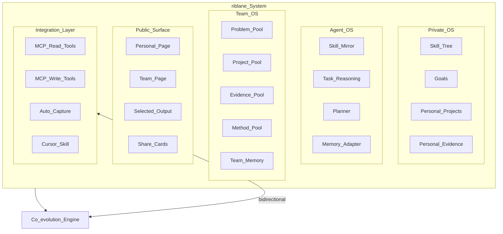
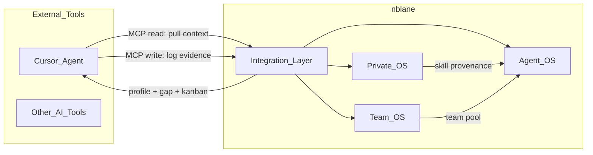
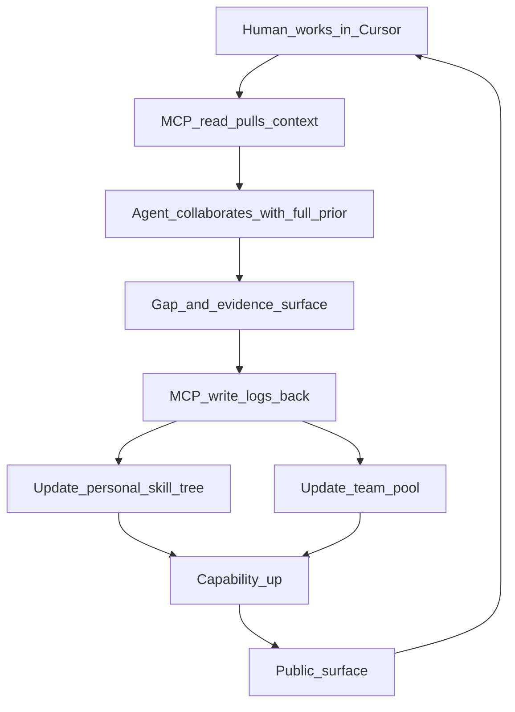
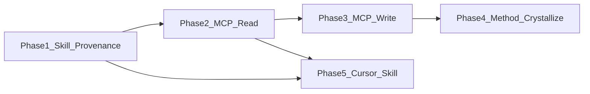

# nblane · Product Design

**Human + Agent + Team co-evolution system**

Engineering-oriented product definition: people do not work alone in the system,
and the agent is not a disposable tool. nblane treats **people, agents, and
team collaboration** as one long-term operating system.

| Item | Current value |
|------|---------------|
| Product version | `v0.2` |
| Document revision | `v0.2.5` |
| Status | Active draft |
| Last updated | `2026-03-22` |

---

## 1. Core definition

### One sentence (must be true)

> **nblane is an operating platform where human capability and agent capability
> co-evolve, and multiple Human + Agent units compound as a team over time.**

### Minimal unit

The atomic unit of nblane is neither a person alone nor an isolated agent:

```text
Human + Agent = one long-term co-evolution unit
multiple units + shared product pool = a long-term compounding team
```

### Why add a team layer

Alone you move fast; together you go far.

In the product, that line must be structure, not only a value:

- Individuals keep getting stronger
- The agent keeps understanding people better
- The team keeps sharing problems, projects, evidence, and methods
- Organizational ability cannot live only in chat; it must sink into a shared
  product pool

### Three equal subjects

```text
Human (you) ── co-evolve ── Agent (your AI counterpart)
      \                           /
       \──── collaborate & persist ────/
                    Team
```

### How they differ

| Dimension | Human | Agent | Team |
|-----------|-------|-------|------|
| Strengths | Judgment, creativity, real experience | Breadth, reasoning speed, execution density | Complementary roles, long-term compounding, scaled collaboration |
| Weaknesses | Limited memory and bandwidth | Cannot collaborate tightly without knowing “who you are” | Fragmentation, duplicated work, scattered knowledge |
| Role in nblane | Real growth | Personalized amplification | Shared throughput and organizational memory |

---

## 2. North star and product goals

### North star (unchanged)

```text
Become top-tier in your domain.
```

### Growth formula

```text
Not only:
Human ↑
Agent ↑
Human + Agent ↑↑

But further:
(Human + Agent) × Team ↑↑↑
```

### Product-level outcomes

nblane should help you finish tasks and compound four long-term assets:

- **Private OS**: your personal growth system
- **Agent OS**: a long-term agent that understands, represents, and assists you
- **Team OS**: shared product pool, collaboration norms, and team memory
- **Public Surface**: shareable personal or team pages for direction, projects,
  evidence, and influence

### Result criteria

- Users do not only complete one-off tasks; capability is continuously
  calibrated
- The agent does not only answer questions; it understands specific people and
  teams better over time
- Teams do not only coordinate in the moment; shared assets thicken over time
- Output does not only stay internal; it can become legible work, evidence, and
  pages outward

---

## 3. Product principles

### 3.1 Atomic unit first

Stand up one `Human + Agent` unit before wiring multiple units into a team.
If the unit does not work, the team layer is empty.

### 3.2 Projects over chat

What compounds is not conversation itself but structured records around problems,
projects, evidence, and retrospectives.

### 3.3 Evidence over slogans

Skills, judgment, and influence should land in projects, outputs, evidence, and
version history whenever possible.

### 3.4 Private by default, share by block

Personal context is private by default; team sharing and public release are
controlled block by block.

### 3.5 Humans are ultimately responsible

The agent may be proactive and generative, but intent, key decisions, and
publication remain with humans.

### 3.6 Teams are not chat rooms; they are compounding machines

The team layer is not primarily a message stream. It is:

- Shared problem pool
- Shared project pool
- Shared evidence pool
- Shared method pool
- Shared context and retrospectives

### 3.7 Skills must have provenance (Skill Provenance)

Every status change in a skill should trace back to concrete output—a project,
paper, codebase, experiment, or patent. A skill label without provenance is a
slogan; a skill tree with provenance is real proof of capability.

### 3.8 Bidirectional integration over one-way output

nblane is not merely a file repository that feeds prompts to LLMs. It is a
bidirectional service where external AI tools can pull context and write back
activity records. The integration interface is a first-class product
capability, not an afterthought.

---

## 4. Ideal users

### 4.1 First ideal users

The first ideal users are not everyone. They:

- Already understand LLMs, agents, context, and prompting at a basic level
- Want to become **AI-native researchers / engineers / builders**
- Refuse to treat AI as a disposable Q&A tool
- Are willing to maintain long-term prior, projects, and evidence
- Want capability, output, team collaboration efficiency, and public influence
  together

### 4.2 Ideal team profile

Teams that fit nblane often:

- Are small and strong—research, engineering, or product-oriented
- Have different individual skills but share a problem domain
- Already use AI but scatter collaboration assets across chat, docs, code, and
  heads
- Want “who knows what, who did what, what is next” to become a sustainable
  system

### 4.3 Not the first target

- People who only want a lightweight todo app
- People unwilling to keep long-term context
- People who want one-click delegation without review or co-building
- Teams that only want short coordination without compounding assets

---

## 5. System structure

### 5.1 Five layers



Plain text:

```text
┌───────────────────────────────────────────────────────────────────┐
│                         nblane System                             │
├────────────┬────────────┬──────────────┬──────────┬───────────────┤
│ Private OS │ Agent OS   │ Team OS      │ Public   │ Integration   │
│            │            │              │ Surface  │ Layer         │
├────────────┼────────────┼──────────────┼──────────┼───────────────┤
│ Skill Tree │ Skill Mirr │ Problem Pool │ Personal │ MCP Read      │
│ Goals      │ Reasoner   │ Project Pool │ Team Pg  │ MCP Write     │
│ Projects   │ Planner    │ EvidencePool │ Selected │ Auto-capture  │
│ Evidence   │ Memory     │ Team Memory  │ Cards    │ Cursor Skill  │
└────────────┴────────────┴──────────────┴──────────┴───────────────┘
                                │
                                ▼
                       Co-evolution Engine
                         (bidirectional)
```

### 5.2 Relationships

- `Private OS`: who I am and what I am growing
- `Agent OS`: how the system understands, assists, and represents me
- `Team OS`: how multiple units share a product pool and compound
  organizationally
- `Public Surface`: how internal assets become outward legible influence
- `Integration Layer`: how external AI tools read and write nblane data

### 5.3 Integration Layer responsibilities

The Integration Layer is the bidirectional interface between nblane and external
AI tools (Cursor, other agent frameworks). It is not an afterthought for v1.0
but a first-class product capability defined starting at v0.2.

**Read path (external tools pull nblane context):**

- User profile summary (skill tree, current focus, working style)
- Current task state (kanban, active projects)
- Capability gap analysis (gap analysis for a given task)
- Team context (shared product pool, team priorities)

**Write path (external tools write activity back to nblane):**

- Log skill practice evidence (skill_id + evidence reference)
- Update project progress
- Append growth log entries
- Trigger skill status change suggestions

**Exposure mechanisms:**

- MCP Server (preferred): expose tools and resources via Model Context Protocol
- Cursor Skill: loaded automatically as a Cursor agent skill
- CLI pipe: compatible with command-line tool chains

---

## 6. Agent roles: not a tool—a “second you”

| Role | Meaning |
|------|---------|
| **Skill Mirror** | The agent knows what you can and cannot do. |
| **Task Reasoner** | The agent judges whether you can complete a task. |
| **Growth Partner** | The agent pushes you to close gaps. |
| **Memory Adapter** | The agent retains your trajectory over time. |
| **Team Interface** | The agent turns personal context into team-actionable information. |

These are not five separate buttons. They are long-term responsibilities of Agent OS:

- Understand you first
- Then judge the task
- Then connect team resources
- Then collaborate to ship
- Then write back to long-term memory and the shared product pool

---

## 7. Data shapes

### 7.1 Human profile

```json
{
  "skills": [
    {
      "name": "3D Perception",
      "level": 4,
      "evidence": [
        {"type": "project", "ref": "6D Pose Module", "date": "2025-06"},
        {"type": "paper", "ref": "Robust 6D Pose under Occlusion", "date": "2025-09"}
      ]
    },
    {
      "name": "World Model",
      "level": 1,
      "evidence": []
    }
  ],
  "goals": ["Become VLA expert"],
  "projects": [],
  "evidence": []
}
```

Each skill embeds an `evidence` list recording the concrete outputs that prove
it (projects, papers, code, experiments, patents, etc.). Skills without
evidence can still exist, but the agent lowers its confidence when judging
depth. This is the data-level realization of Skill Provenance (principle 3.7).

### 7.2 Agent profile

```json
{
  "understanding_of_user": {
    "strengths": ["perception"],
    "weaknesses": ["world model"],
    "current_focus": ["VLA"]
  },
  "working_style": {
    "prefers": ["structured plans", "evidence-backed decisions"],
    "avoids": ["vague delegation"]
  },
  "confidence": 0.7
}
```

The agent does not mirror you literally; it **models its understanding of you**
and exposes a stable collaboration interface.

### 7.3 Shared context (bridge)

```json
{
  "current_task": "Design VLA model",
  "required_skills": ["VLA", "world model"],
  "gap_detected": ["world model"],
  "recommended_support": ["paper review", "baseline implementation"]
}
```

### 7.4 Team profile

```json
{
  "team_name": "Embodied AI Lab",
  "shared_focus": ["VLA", "embodied intelligence"],
  "members": ["narwal", "alice", "bob"],
  "shared_rules": [
    "private by default",
    "evidence before opinion",
    "humans approve public release"
  ],
  "current_priorities": ["robot data engine", "world model eval"]
}
```

### 7.5 Shared product pool

```json
{
  "problem_pool": [
    "How to build a robust VLA baseline?"
  ],
  "project_pool": [
    "VLA Model Design",
    "Data Engine Prototype"
  ],
  "evidence_pool": [
    {
      "title": "6D Pose ablation on occlusion",
      "type": "experiment",
      "linked_skills": ["pose_estimation"],
      "linked_project": "6D Pose Module",
      "author": "narwal",
      "date": "2025-08"
    },
    {
      "title": "VLA baseline benchmark v1",
      "type": "benchmark",
      "linked_skills": ["vlm_robot", "imitation_learning"],
      "linked_project": "VLA Model Design",
      "author": "alice",
      "date": "2026-01"
    }
  ],
  "method_pool": [
    "prompt template",
    "evaluation checklist",
    "experiment playbook"
  ]
}
```

The shared product pool is the key new object at the team layer. It is not
merely a folder; it is the team’s unified view of what is being solved, what is
validated, and what can be reused.

Each evidence entry links back to individual skills via `linked_skills` and to
projects via `linked_project`, forming a bidirectional index. This connects
team evidence with personal Skill Provenance into a unified knowledge graph.

### 7.6 Public profile

```json
{
  "headline": "AI-native team building VLA systems",
  "current_focus": ["VLA", "embodied intelligence"],
  "featured_projects": ["VLA Model Design"],
  "public_evidence": ["demo", "blog", "paper note"],
  "share_url": "https://example.com/team/embodied-ai"
}
```

---

## 8. Co-evolution engine

### 8.1 One-way is no longer enough

The previous co-evolution engine described only a conceptual loop: human does
task → agent collaborates → gap found → update. That path had a single input
source (human edits files) and a single output (\`nblane context\` generates a
prompt). In practice, when working in Cursor, the agent should be able to:

- Pull user context proactively (instead of requiring manual "who I am" each time)
- Write results back to nblane automatically during collaboration

### 8.2 Bidirectional technical loop



Plain text:

```text
<<<  Read Path  <<<              >>> Write Path >>>
Cursor <-- MCP read -- nblane     Cursor -- MCP write --> nblane
  |    (profile, gap,                |    (evidence, log,
  |     kanban, team)                |     project update)
  |                                  |
  +-- Agent already knows            +-- Results auto-persist
      who you are, what                  to skill-tree
      you\'re doing, gaps               and evidence
```

### 8.3 Individual loop (with MCP)

```text
Input: task (user starts working in Cursor)
  → Cursor Agent pulls nblane context via MCP read
  → Agent infers required skills
  → Compare with human skill tree (including evidence depth)
Output:
  - what you can do (with evidence backing)
  - what you cannot do yet (no evidence or insufficient)
  - what support you need
Write-back:
  - Log skill practice evidence via MCP write
  - Update project progress via MCP write
```

### 8.4 Team loop (with MCP)

```text
Input: tasks and context from multiple members
  → Agent aggregates gaps, dependencies, duplicated work
  → Aligns with the shared team product pool
Output:
  - who is best suited (based on personal skill + evidence)
  - which assets can be reused
  - what should be written back to the team pool
Write-back:
  - Write evidence to team evidence_pool (with linked_skills)
  - Write methods to method_pool
```

### 8.5 Two-layer updates

When gaps are found, write to two layers:

- **Individual**: skill tree (with evidence updates), focus, agent prior,
  next-step suggestions
- **Team**: problem pool, project pool, evidence pool (structured), method
  pool, team memory

### 8.6 Complete data flow



Plain text:

```text
Human works in Cursor
  → MCP read pulls nblane context
  → Agent collaborates with full prior
  → Gaps surface + evidence produced
  → MCP write logs back to nblane
  → Update personal skill tree (with evidence)
  → Update team shared product pool
  → Capability and org throughput rise
  → Present outward
  (repeat)
```

---

## 9. Project-driven work: from dual subjects to teams

### 9.1 Project shape

```json
{
  "name": "VLA Model Design",
  "owner": "team",
  "operators": ["human", "agent"],
  "required_skills": ["VLA", "world model"],
  "linked_pool_items": ["baseline", "eval checklist"],
  "status": "ongoing"
}
```

### 9.2 Division of labor

| Phase | Human | Agent | Team |
|-------|-------|-------|------|
| Problem framing | Lead | Assist reasoning | Align priorities |
| Design | Collaborate | Collaborate | Provide history and constraints |
| Implementation | Collaborate | Collaborate | Assign modules and reuse assets |
| Retrospective | Decide | Lead analysis | Write back to the shared pool |

### 9.3 Default collaboration mode

Implementation defaults to **pair delivery**:

- The agent can own code, research, config, tests, and drafting
- The human owns intent, key decisions, review, and merge
- The team owns context reuse, asset sync, prioritization, and knowledge
  persistence

### 9.4 Projects are not islands

In nblane, a project should connect to four things:

- Which problem in the problem pool it addresses
- Which shared methods or evidence it reused
- Which capability gaps it exposed
- What it should write back to the shared pool when done

### 9.5 Method crystallization: from work sessions to reusable knowledge

Consider a concrete scenario: you reproduce a VLA algorithm. Along the way you
hit hardware issues, dependency conflicts, data format problems, and model
configuration puzzles. Some you solve by researching yourself; others by asking
Cursor. Eventually the work completes. What happens to all that hard-won
knowledge?

Without nblane, it evaporates into chat history and memory. With nblane, the
project should **crystallize** into three outputs:

**1. A structured method (playbook)**

```json
{
  "title": "Reproduce PI0.5 on Piper arm",
  "source_project": "VLA Reproduction",
  "problems_encountered": [
    {"domain": "hardware", "problem": "USB latency on real robot",
     "solution": "switch to direct serial", "source": "self-research"},
    {"domain": "code", "problem": "action space mismatch",
     "solution": "normalize to [-1,1] before policy input",
     "source": "cursor-interaction"}
  ],
  "steps": ["...ordered steps..."],
  "prerequisites": ["ROS2 basics", "imitation_learning"],
  "author": "narwal",
  "date": "2026-03"
}
```

**2. Skill evidence (per-skill provenance)**

Each problem-solution pair maps to one or more skill nodes. Solving the USB
latency problem is evidence for `real_robot_ops`; fixing the action space
mismatch is evidence for `imitation_learning`. These flow into the
corresponding skill’s `evidence` list.

**3. Team-reusable asset**

The method enters the team’s `method_pool`; problem-solution pairs with
`linked_skills` enter the `evidence_pool`. Next time anyone on the team needs
to reproduce a VLA model, the playbook is already there.

**Two sources of raw material:**

- **Human active recording**: the user explicitly logs key decisions, aha
  moments, and lessons. This is the high-signal source.
- **Agent interaction log**: questions the user asked Cursor, problems the
  agent helped solve, code changes the agent suggested. This is the
  high-volume source. nblane should capture and structure these
  interactions as candidate problem-solution pairs.

**Crystallization flow:**

```text
Project in progress
  → Human solves problems (self-research)
  → Human asks Agent for help (interaction log captured)
  → Project completes
  → Agent synthesizes:
      - problem-solution pairs (from both sources)
      - ordered steps (playbook)
      - skill evidence (mapped to skill nodes)
  → Human reviews and confirms
  → Method written to method_pool
  → Evidence written to personal skill tree + team evidence_pool
```

The key insight: **the process of doing work IS the raw material for the
method. You should not have to write the method separately after finishing.**

---

## 10. Team collaboration and shared product pool

This section is the main addition of this product revision.

### 10.1 Why teams need a shared product pool

Without it, teams tend to:

- Re-research the same questions
- Scatter conclusions across chat, meetings, and heads
- Leave newcomers without a clear on-ramp
- Let agents understand only individuals, not team state

The pool makes the collaboration object explicit.

### 10.2 What belongs in the pool

At minimum:

- **Problem Pool**: key questions the team is chasing
- **Project Pool**: projects and experiments around those questions
- **Evidence Pool**: conclusions, experiments, demos, benchmarks, references
- **Method Pool**: prompt templates, review checklists, experiment playbooks,
  workflows
- **Decision Pool**: key decisions and why they were made

### 10.3 Product value at the team layer

The team layer is not “multiplayer online” as a shallow feature. It enables:

- **Shared focus**: everyone knows the most important problems
- **Shared memory**: judgments and evidence do not vanish
- **Shared amplification**: one person’s insight becomes reusable team asset

### 10.4 Minimum team workflow

```text
Individual generates a task or idea
  → Agent checks linkage to team problems
  → On hit, write to the shared product pool
  → Team assigns work and reuses existing assets
  → Ship results
  → Write results back to the team pool
```

### 10.5 Permissions and boundaries

- Personal prior is private by default
- The team pool is visible to the team by convention
- Public content must be explicitly published
- Sensitive context does not auto-enter the public surface
- Anything that “speaks for the team” needs a named human owner

---

## 11. Public page and sharing

This layer turns nblane from an internal growth system into an outward influence
system.

### 11.1 Why it matters

- Growth must be legible, not only real
- Projects must be showable, not only finished
- Teams need a clear external narrative, not only collaboration

### 11.2 What to show

Personal and team public surfaces can share a structure:

- North Star / one-line positioning
- Current research or engineering focus
- Skill or capability summary
- Featured projects
- Public evidence
- Recent important updates
- Selected outputs from agent collaboration

### 11.3 Generation flow

```text
Private data (profile / project / evidence / team pool)
  → Agent organizes and distills
  → Human reviews
  → Generate personal or team page
  → Share outward
```

### 11.4 Publishing rules

- Private by default
- Block-level visibility
- Shareable links
- Public content always requires final human approval

---

## 12. Social, connections, and personal / team IP

### 12.1 Social

The pain is often not “no social network” but not knowing whom to connect with,
why, and what to say.

nblane uses the agent, with personal and team context, to suggest who works on
similar problems, who is worth connecting with, and how to start.

Example:

```json
{
  "suggested_connections": [
    {
      "target": "researcher_x",
      "reason": "working on VLA evaluation",
      "action": "share ablation note and ask for feedback"
    }
  ]
}
```

### 12.2 Personal IP

Shift:

- From: human writes everything
- To: the agent amplifies your impact

### 12.3 Team IP

Further shift:

- From: the team re-explains itself every time
- To: the team maintains an updated external narrative automatically

Flow:

```text
You or the team ships a project
  → Agent extracts viewpoints
  → Drafts (blog / page / thread / update)
  → Human reviews
  → Publish
```

The personal page answers “who am I”; the team page answers “what we solve
together.”

---

## 13. Integration architecture and auto-capture

This section defines the product’s approach to external integration and
automatic activity capture.

### 13.1 nblane as MCP Server

nblane should run as an MCP Server, exposing the following tools and resources
to external AI tools such as Cursor:

**MCP Resources (read-only context):**

| Resource URI | Returns |
|--------------|---------|
| `nblane://profile/{name}/summary` | Skill tree summary + current focus + working style |
| `nblane://profile/{name}/kanban` | Current task board |
| `nblane://profile/{name}/gap?task=X` | Capability gap analysis for task X |
| `nblane://team/{id}/pool` | Team shared product pool |

**MCP Tools (write operations):**

| Tool | Parameters | Purpose |
|------|------------|---------|
| `log_skill_evidence` | skill_id, type, ref, date | Log a skill practice evidence |
| `update_project_progress` | project, status, note | Update project progress |
| `append_growth_log` | name, event | Append a growth log entry |
| `suggest_skill_upgrade` | skill_id, new_status | Suggest skill status change (requires human confirm) |

### 13.2 Cursor Skill integration

nblane can be loaded as a Cursor agent skill. Once loaded, the Cursor Agent
automatically receives user context at the start of every session without the
user having to explain their background manually.

Typical scenario:

```text
User opens a project in Cursor
  → nblane skill auto-injects user profile
  → Agent knows the user’s skills, gaps, working style
  → Gives more targeted feedback
  → Especially during project analysis, provides gap-aware feedback
```

### 13.3 Auto-capture mechanism

Updating the skill tree should not depend solely on manual file editing. Via
MCP write tools, external tools can capture skill practice automatically during
work:

**Capture trigger points:**

- User completes a code commit (touching a specific skill domain)
- User completes a code review
- User solves a complex problem
- Agent observes repeated practice in a domain

**Capture flow:**

```text
Development activity occurs
  → Agent identifies the skill nodes involved
  → Calls log_skill_evidence via MCP write
  → Evidence written to corresponding skill-tree.yaml node
  → When enough evidence accumulates, suggest status upgrade
  → Human confirms before upgrade executes
```

**Safety principles:**

- Evidence is auto-written, but skill status upgrades require human confirmation
- All auto-captured content is visible, auditable, and reversible by the user
- Sensitive content is never auto-written to the team pool or public surface

### 13.4 Interaction log as knowledge source

When you ask Cursor a question, that interaction is not throwaway chat—it is
raw material for knowledge. nblane should capture agent interactions as a
structured log:

```json
{
  "session_id": "abc123",
  "project": "VLA Reproduction",
  "interactions": [
    {
      "timestamp": "2026-03-20T14:30:00Z",
      "question": "action space mismatch between policy and robot",
      "domain": "imitation_learning",
      "resolution": "normalize actions to [-1,1] range",
      "resolved_by": "agent"
    },
    {
      "timestamp": "2026-03-20T16:10:00Z",
      "question": "USB latency causing dropped frames",
      "domain": "real_robot_ops",
      "resolution": "switched to direct serial connection",
      "resolved_by": "human"
    }
  ]
}
```

This log serves three purposes:

- **Method raw material**: when the project completes, the agent synthesizes
  interactions into a structured playbook (see 9.5)
- **Skill evidence**: each resolved problem maps to a skill node and becomes
  provenance
- **Agent memory**: the agent learns which problem patterns this user tends to
  encounter and how they prefer to solve them

**MCP tool for interaction logging:**

| Tool | Parameters | Purpose |
|------|------------|---------|
| `log_interaction` | project, question, domain, resolution, resolved_by | Record a problem-solution pair from an agent session |
| `crystallize_method` | project, human_confirms | Synthesize all interactions + manual logs into a structured playbook |

---

## 14. Core functions (must-have)

| Function | Role | Interface |
|----------|------|-----------|
| `can_solve(task)` | Whether you can complete the task now | CLI + MCP resource |
| `detect_gap(task)` | Detect capability or resource gaps | CLI + MCP resource |
| `suggest_next_action()` | Best next step | CLI + MCP resource |
| `update_both(human, agent)` | Co-evolution update | CLI + MCP tool |
| `log_skill_evidence()` | Log skill practice evidence | MCP tool |
| `log_interaction()` | Record a problem-solution pair from an agent session | MCP tool |
| `crystallize_method()` | Synthesize work session into a structured playbook | CLI + MCP tool |
| `sync_team_pool()` | Write valuable results to the shared pool | CLI + MCP tool |
| `route_to_best_owner()` | Who should own the task | CLI + MCP resource |
| `build_public_profile()` | Build personal or team public data | CLI |
| `select_public_evidence()` | Select public evidence | CLI |
| `generate_share_page()` | Generate a share page | CLI |

These are **product contracts**; each function now has an explicit interface
type, making them not only internal contracts but callable interfaces for
external tools.

---

## 15. Open-source mission

> **The open-source goal of nblane is not to build a generic productivity tool,
> but to patiently help every person and every team own a long-term AI
> collaboration system.**

That system understands individuals and teams better over time and compounds
long-term.

### Why open source

- So each person can own a long-term agent instead of a closed platform
- So prior, growth records, project evidence, and team memory stay user-owned
- So the community explores how AI-native researchers, engineers, and teams
  should work

### The real hook

Not only a skill tree, and not only an agent. Five together:

- Long-term personal growth records
- A long-term AI counterpart
- A long-term team shared product pool
- Shareable personal and team influence surfaces
- Bidirectional integration interfaces letting AI tools read and write your
  growth system

---

## 16. MVP roadmap

### v0.1 (shipped)

- Human profile
- Skill tree
- Simple gap detection

### v0.2 (current)

- Agent profile
- Task analysis
- Bidirectional updates
- Skill Provenance: skill nodes support structured evidence links

### v0.3

- MCP Server: nblane exposes read/write interfaces to external tools
- Cursor Skill integration: auto-load user context as a Cursor agent skill
- Auto-capture: log skill practice evidence via MCP write automatically

### v0.4

- Shared product pool
- Team collaboration view
- Personal / team pages
- Public evidence selection and share links

### v1.0

- More stable long-term memory and automated loop
- Mature team collaboration and public presentation pipeline
- Multi-AI-tool integration (beyond Cursor)

---

## 17. Version management

Two layers: **product version** and **document version**.

### 17.1 Product versions

Use `vMAJOR.MINOR`:

- `v0.1`: Human OS foundation
- `v0.2`: Human + Agent dual system + Skill Provenance
- `v0.3`: MCP Server + Cursor integration + auto-capture
- `v0.4`: Team OS + Public Surface
- `v1.0`: Mature long-term AI collaboration system

### 17.2 Document versions

This manual uses `vMAJOR.MINOR.PATCH`:

- `MAJOR`: fundamental product definition change
- `MINOR`: new top-level capability or major section
- `PATCH`: wording, structure, examples, mappings

### 17.3 Change log

| Document version | Notes |
|------------------|-------|
| `v0.2.0` | Initial dual-system product manual |
| `v0.2.1` | Ideal user, public page, open-source mission, version management |
| `v0.2.2` | Tighter core definition; Team OS and shared product pool |
| `v0.2.3` | Integration Layer, Skill Provenance, bidirectional co-evolution engine, auto-capture |
| `v0.2.4` | Method crystallization from work sessions, interaction log as knowledge source |
| `v0.2.5` | Demo 1 expanded to full personal + agent interaction loop (5-phase dev plan) |

### 17.4 Bump rules

- New top-level capability (e.g. Team OS or public surface): bump `MINOR`
- Wording, diagrams, examples only: bump `PATCH`
- When product version changes, update the roadmap and history in the same
  change

---

## 18. Minimum demos (next build targets)

### Demo 1: Complete personal + agent interaction loop

The goal of Demo 1 is not just "judge capability" but to walk through the full
personal + agent interaction loop: Cursor pulls context, collaborates with
prior, auto-writes evidence and methods. All components run on the same
machine (local stdio transport, no network).

**End-to-end scenario after completion:**

```text
User starts "reproduce PI0.5 VLA algorithm" in Cursor
  → Cursor Agent pulls user profile via MCP read
     (skill tree, gaps, current tasks, working style)
  → Agent knows imitation_learning is still learning,
     but pose_estimation is solid with paper evidence
  → Gives targeted feedback: explains RL in detail, skips perception basics
  → During collaboration, every Q&A auto-logged as interaction
  → After project completes, Agent synthesizes playbook + skill evidence
  → User confirms, writes to skill-tree + method_pool
```

#### Phase 1: Foundation upgrade (Skill Provenance)

Goal: make skill tree nodes support structured evidence.

| Task | Description | Files |
|------|-------------|-------|
| Extend SkillNode model | Add `evidence: list[Evidence]` field | `core/models.py` |
| Extend skill-tree.yaml format | Read/write nodes with evidence | `core/io.py` |
| Update gap analysis | Factor evidence depth into capability judgment | `core/gap.py` |
| Update context generation | Include key evidence summary in system prompt | `core/context.py` |
| Update Web UI | Show/edit evidence in skill tree editor | `pages/1_Skill_Tree.py` |
| New CLI command | `nblane evidence <name> <skill_id> add ...` | `cli.py` |

**Acceptance criteria:**
- `nblane gap 王军 "reproduce VLA"` output shows "`pose_estimation`
  is solid with 2 evidence items; `imitation_learning` is learning with
  no evidence"
- `nblane context 王军` system prompt includes evidence summary

#### Phase 2: MCP Server — Read Path

Goal: let Cursor pull nblane context via MCP.

| Task | Description | Files |
|------|-------------|-------|
| Implement MCP Server framework | Python MCP SDK, stdio transport | New `src/nblane/mcp_server.py` |
| Implement resource: profile/summary | Return skill tree summary + focus + style | `mcp_server.py` |
| Implement resource: profile/kanban | Return current task board | `mcp_server.py` |
| Implement resource: profile/gap | Return gap analysis for a given task | `mcp_server.py` |
| Implement resource: context | Return full system prompt | `mcp_server.py` |
| Cursor config | Register local MCP Server in `.cursor/mcp.json` | `.cursor/mcp.json` |

**Transport:** stdio (Cursor and nblane on same machine, no network).
Cursor launches `python -m nblane.mcp_server` as a subprocess.

**Acceptance criteria:**
- Open a new Cursor session; Agent automatically knows who the user is,
  skill state, and what they are working on
- User never manually explains background; Agent gives capability-aware
  feedback

#### Phase 3: MCP Server — Write Path

Goal: let external tools write data back to nblane.

| Task | Description | Files |
|------|-------------|-------|
| Implement tool: log_skill_evidence | Log a skill practice evidence item | `mcp_server.py` + `core/io.py` |
| Implement tool: append_growth_log | Append a growth log entry | `mcp_server.py` + `cli.py` |
| Implement tool: log_interaction | Record a problem-solution pair | `mcp_server.py` + new `core/interaction.py` |
| Implement tool: suggest_skill_upgrade | Suggest status upgrade (needs human confirm) | `mcp_server.py` |
| Interaction log storage | New `profiles/{name}/interactions/` directory | `core/io.py` |

**Acceptance criteria:**
- After solving a problem in Cursor, Agent auto-calls
  `log_skill_evidence` to record evidence
- Corresponding skill node’s evidence list in `skill-tree.yaml`
  updates automatically
- Interaction logs saved under `profiles/{name}/interactions/`

#### Phase 4: Method crystallization

Goal: auto-synthesize work sessions into reusable methods on project
completion.

| Task | Description | Files |
|------|-------------|-------|
| Implement tool: crystallize_method | Read interaction logs + manual logs, call LLM to synthesize playbook | `mcp_server.py` + new `core/crystallize.py` |
| Playbook storage | New `profiles/{name}/methods/` directory | `core/io.py` |
| Evidence write-back | Auto-write problem-solution pairs to corresponding skill evidence | `core/crystallize.py` |
| Human confirmation flow | Playbook generated as draft; writes only after human confirms | `mcp_server.py` |

**Acceptance criteria:**
- After reproducing VLA, call `crystallize_method`
- Auto-generates "How to reproduce PI0.5 on Piper arm" playbook
- Playbook contains problem-solution pairs (labeled self vs agent source)
- Corresponding skill nodes’ evidence auto-updates

#### Phase 5: Cursor Skill integration

Goal: make nblane context auto-load in Cursor sessions.

| Task | Description | Files |
|------|-------------|-------|
| Create Cursor Rule | nblane context summary as auto-loaded rule | `.cursor/rules/nblane-context.mdc` |
| Auto-update rule | `nblane sync-cursor` command refreshes rule content | `cli.py` |
| MCP + Rule synergy | Rule provides static context; MCP provides dynamic queries | Config layer |

**Acceptance criteria:**
- Open Cursor with zero manual setup; Agent already knows user capability
- Type "help me reproduce VLA algorithm"; Agent’s response automatically
  considers strengths and weaknesses instead of giving generic answers

#### Phase dependency



Plain text:

```text
Phase 1 (Skill Provenance)
  → Phase 2 (MCP Read) → Phase 3 (MCP Write) → Phase 4 (Crystallize)
  → Phase 5 (Cursor Skill) (also depends on Phase 1 + 2)
```

#### Technical constraints

- **Transport:** stdio (local subprocess, no network)
- **MCP SDK:** Python `mcp` official SDK
- **LLM dependency:** only Phase 4 crystallization requires LLM; all other
  phases are rule-based
- **Storage:** plain files (YAML + Markdown + JSON), no database
- **Safety:** all writes visible to user; skill upgrades require human
  confirmation

### Demo 2: Team shared product pool

```text
Input: multiple members’ profiles, projects, evidence
  → Agent finds duplicated questions and reusable assets
  → Output:
      - team problem pool
      - team project pool
      - evidence and methods to persist in the pool
```

### Demo 3: Public presentation generation

```text
Input: personal / team profile, projects, evidence
  → Agent distills public-facing information
  → Generates a shareable personal or team page
```

### Demo 4: MCP integration loop

```text
Input: user starts a project in Cursor
  → Cursor Agent pulls nblane context via MCP read
  → Agent collaborates with full prior
  → After completing the task, writes evidence back via MCP write
  → Evidence appears in the corresponding skill node’s evidence list
```

---

## 19. Product essence

> **nblane makes AI not merely a tool, but a growth counterpart—and makes teams
> not merely chat groups, but compounding systems.**

Tagline:

> **AI learns YOU, grows WITH YOU, and compounds THROUGH TEAMS.**

---

## 20. Mapping to this repository

Concept names above are **product vocabulary**. Current repo alignment:

| Product concept | In the repo now |
|-----------------|-----------------|
| Human profile | `profiles/{name}/SKILL.md`, `skill-tree.yaml`, `kanban.md` |
| Skill tree | `skill-tree.yaml` + `schemas/` |
| Skill Provenance | Skill node evidence field; product definition shipped, data model pending |
| Agent prior | Output of `nblane context <name>` (system prompt) |
| Agent profile | Optional `profiles/{name}/agent-profile.yaml`, merged by `context` |
| Integration Layer | MCP Server + Cursor Skill; product definition shipped, impl roadmap v0.3 |
| Auto-capture | MCP write tools; product definition shipped, impl roadmap v0.3 |
| Team OS | `teams/<id>/team.yaml` + `product-pool.yaml`; `nblane team <id>` summary |
| Shared product pool | File conventions shipped; automated sync / routing still roadmap |
| Personal / team pages | Not shipped yet; design with team layer |
| `can_solve` / `detect_gap` | `nblane gap` (rules layer); will be exposed via MCP resource |
| Co-evolution loop | Bidirectional: MCP read pull + MCP write back + human edits files |

Implementation principles and scope: [architecture.md](architecture.md).
