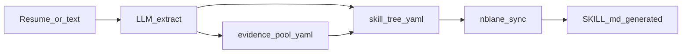
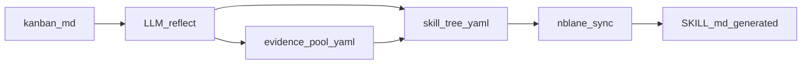

# Demo 1 · Profile 文档关系与闭环

本文说明个人 Profile 下各文件如何协作：**谁是单一事实来源**、**一次更新应按什么顺序写文件**、以及**简历导入 / 看板闭环 / 手动触发**三类场景下的建议流程与 LLM 契约。

与 [design.md](design.md) 的原则一致：**Plain text first**、**Git as database**、**Progressive enhancement**。文中区分 **已落地能力**（CLI、`nblane sync` 等）与 **需产品化或后续 Phase 的自动化契约**。

| 项 | 值 |
|----|-----|
| 文档版本 | `v0.1.0` |
| 状态 | Active |
| 最后更新 | `2026-03-22` |

---

## 1. Artifact 矩阵（静态关系）

| 文件 | 职责 | 单一事实来源？ | 主要消费方 |
|------|------|----------------|------------|
| `schemas/*.yaml` | 节点 id、标签、层级、`requires` 等 | **领域技能树结构定义** | `skill-tree.yaml` 校验、`nblane sync` 渲染标签 |
| `skill-tree.yaml` | 每节点 `status` / `note` / `evidence` / `evidence_refs` | **个人技能状态与证据关联的权威来源** | `validate`、`gap`、`context`、`sync` |
| `evidence-pool.yaml` | 稳定 `id` 的共享证据行（`EvidenceRecord`） | **共享证据目录**（被 `evidence_refs` 引用） | `resolve`、校验引用存在性 |
| `SKILL.md` | 人类叙事、身份、研究品味；含生成块 | **派生**：`<!-- BEGIN GENERATED:* -->` 块由树 + schema **确定性**渲染 | Agent 系统提示（与 `context` 合并） |
| `agent-profile.yaml` | Agent 侧结构化先验（强弱、风格等） | 与技能树**正交** | `nblane context` |
| `kanban.md` | 近期工作计划（Doing / Done / Queue 等） | 与技能树**正交** | `plan` 模式、`context`（可选） |

**要点**：`SKILL.md` **不是**技能状态的第二来源。`Skill Tree` 等生成块必须与 `skill-tree.yaml` 一致；否则 `nblane sync <name> --check` 会报告 drift。Identity、Research Fingerprint 等非生成章节仍由人维护。

---

## 2. 数据流图（动态关系）

### 2.1 简历 / 长文本 → 证据与树 → SKILL

### 2.2 看板完成 → 反思 → 证据与树 → SKILL

---

## 3. 场景 A：Profile 冷启动（全 locked → 简历 → 有依据的树）

**初始化**：`nblane init` 使用模板得到全 `locked`（或模板约定初始状态）的 `skill-tree.yaml`、空或最小的 `evidence-pool.yaml`、模板 `kanban.md` 与 `agent-profile.yaml`。

**简历摄入（设计契约）**

1. **LLM 输出 1 — `evidence-pool.yaml` 增量**  
   每条为 `EvidenceRecord`：`id`、`type`、`title`、`date`、`url`、`summary`，可选 `deprecated` / `replaced_by`。与 [design.md §5.1](design.md) 一致。

2. **LLM 输出 2 — `skill-tree.yaml` 的补丁语义**  
   非随意全文重写；仅更新与简历可核验内容对应的节点：  
   - 填写 `evidence_refs`（指向 pool `id`）与/或内联 `evidence`；  
   - 可选更新 `note`；  
   - 仅在**有依据**时将 `status` 从 `locked` 提升至 `learning` / `solid`（是否检查 `requires` 闭包由流程约定：建议 **`nblane validate` 能过**为准）。

**确定性步骤（人机共审）**

1. 合并 YAML（人工或脚本）。  
2. `nblane validate <profile>`。  
3. `nblane sync <profile> --write`。

**现状**：已实现 **`nblane ingest-resume <name> --file path | --stdin`**（`--dry-run` 仅打印合并草案）、**Home（`app.py`）** 中「简历 / 长文本」折叠区：LLM 产出 JSON 补丁 → `core/profile_ingest` 合并 pool → tree → `validate` + `sync --write`；默认不应用 `status`，除非 CLI `--allow-status-change` 或 Web 勾选「允许 AI 更新节点状态」。

---

## 4. 场景 B：看板周闭环（计划 → 完成 → 技术反思 → 证据 → 树 → SKILL）

**输入**：`kanban.md` 中 **Done**（或本周标记完成的条目）。

**LLM 分析（设计契约）**

- 从 Done 条目抽取**技术栈与可验证成果**；  
- 映射到 schema 中的 **节点 id**；  
- 产出：新 `evidence-pool` 行 + 相关节点的 `evidence_refs` / `note` 更新。

与 [design.md](design.md) **Demo 1 Phase 4（方法结晶）**的关系：此处是**轻量版**——优先**证据写回**；可复用的 playbook / 方法稿可后移或由 `crystallize` 类流程承担。

**确定性步骤**：同场景 A：`validate` → `sync --write`。

**现状**：已实现 **`nblane ingest-kanban <name>`**（`--dry-run` / `--allow-status-change`）、**Kanban 页**「已完成 → 证据」：对多选 Done 任务调用同一合并管线；默认不改 `status`。

---

## 5. 场景 C：手动触发

| 触发 | 读入 | 写回 / 产出 |
|------|------|----------------|
| 分析本周计划 | `kanban.md` + 当前树（+ 可选 pool） | **仅 gap 报告**不入库；或输出**草案补丁**待人确认后再写入 YAML |
| 单条任务 skill gap | 任务文本 + 树 + pool | 规则层：`nblane gap`；LLM 增强与 Streamlit Gap Analysis 页一致时可叠加 |
| 将已完成计划升格为 evidence | Done 条目 | 新 pool 行 + 节点 `evidence_refs`；**不自动改 `status`**，除非用户明确确认 |

---

## 6. 更新顺序与不变量

建议**固定顺序**，避免「引用不存在的 pool id」或「生成块与树不一致」：

1. **`evidence-pool.yaml`**：先存在稳定 `id`，再在树里引用。  
2. **`skill-tree.yaml`**：`evidence_refs` 仅指向 pool 已有 id；`nblane validate` 应通过。  
3. **`SKILL.md` 生成块**：仅通过 **`nblane sync --write`** 更新；避免手改生成块。  
4. **`agent-profile.yaml`**：任意时刻人工编辑，与树无硬依赖。

---

## 7. 与路线图（design）的衔接

| 能力 | 状态 | 说明 |
|------|------|------|
| Skill Provenance（内联 + pool + `evidence_refs` + resolve） | 已交付（Phase 1） | 见 [design.md §5](design.md) |
| `nblane sync` / `validate` / `gap` / `evidence` | 已落地 | 见 design 基线盘点 |
| LLM 自动写回 Profile | **部分已交付**（ingest-resume / ingest-kanban + Web） | 合并与校验在 `core/profile_ingest.py`；MCP Write / 更多工具名仍可与 design **Phase 3** 对齐 |
| 方法结晶 / playbook | Phase 4 | 可与场景 B 演进合并 |

---

## 8. 诚实边界

- **SKILL「来自 skill-tree」**：指 **生成块**由 `skill-tree.yaml` + schema **确定性**生成；其余章节仍为人写。  
- **自动化**：推荐 **LLM 出补丁 → 人确认 → validate + sync**，与 crystallize 类流程「先草案再晋升」的精神一致。

---

## 9. 相关文档

- [Design manual & milestones](design.md)  
- [Skill evidence](evidence.md)  
- [Architecture](architecture.md)  
- [SKILL.md format](profile-format.md)
- [File storage evolution](file-storage-evolution.md) — public layer, personal website storage, media, and multi-user boundaries
