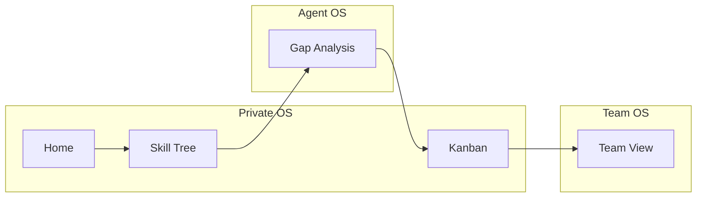

# Web experience design (Streamlit)

**中文：** [Web 体验设计（Streamlit）](zh/web-ui-product.md)

This chapter describes **information architecture, first-screen narrative,
title and brand consistency, layout rhythm, and alignment with product
layers** from [product.md](product.md). It is not a full visual design
system. Optional implementation items are listed as a **backlog** for
later iterations.

| Item | Value |
|------|-------|
| Scope | Local Streamlit app (`app.py`, `pages/`) |
| Companion | [design.md](design.md) §3.4 (shipped page inventory) |
| Out of scope | Custom CSS / component libraries, MCP UI, replacing Streamlit |

---

## 1. Role and scope

The Web UI is a **local, file-backed tool** aligned with the CLI and repo
layout (`profiles/`, `teams/`). It is **not** the [Public
Surface](product.md) roadmap item: no hosted pages or share URLs.

**Boundary:** Everything mutates plain Markdown / YAML on disk; behavior
should stay explainable next to `nblane` commands in [design.md](design.md).

---

## 2. Current diagnosis (product lens)

### 2.1 Feature coverage vs narrative

| Product layer ([product.md](product.md)) | Web mapping | Gap |
|------------------------------------------|-------------|-----|
| **Private OS** (skills, goals, projects, evidence) | Skill Tree, Kanban, Home overview, evidence pool | No dedicated **Goals** entry; Home emphasizes SKILL.md and summary—relationship to “skill tree as main hub” is not obvious for new users |
| **Agent OS** | Gap Analysis (rules + optional LLM), context-oriented copy | No explicit framing that this page is the **agent collaboration** surface |
| **Team OS** | Team View | Relationship to sidebar **Profile** is unclear; Team View calls `select_profile()` but **does not use** its return value—risk of “does picking a profile affect team data?” |

**Summary:** Feature density matches the file model, but **task → page**
guidance is thin. Product language (co-evolution, evidence provenance) is
mostly implicit in the UI.

### 2.2 Layout and rhythm

- **Home** (`app.py`): Overview metrics, category progress, collapsible
  categories, resume ingest, and a long `home_nav` Markdown block. The
  vertical chain is **long**; the first screen does not strongly answer
  “where do I click next?”.
- **Skill Tree** (`pages/1_Skill_Tree.py`): Primary **Save** sits in the
  title row—**unique** among the four subpages; Kanban uses a different
  toolbar pattern (e.g. Reload / Save).
- **Gap / Kanban:** Wide tables and expanders fit a tool-style product.
  When the LLM is not configured, prompts rely on shared helpers and
  per-page `ai_not_configured` copy—**unifying empty-state wording** (as a
  small component pattern) would reduce inconsistency.

### 2.3 Titles and brand

| Location | Today | Issue |
|----------|--------|--------|
| Browser tab (Home) | `app_page_title` is **NBL** in `web_i18n` `_HOME` | **Brand split:** README uses “nblane · 大佬之路”; subpages use “· nblane” |
| Sidebar | `### Profile` (same in en/zh) | Weak hierarchy; **Profile** stays English in many zh strings |
| zh locale | `LLM_REPLY_LANG=zh` drives copy, but `home_nav` and similar blocks still list **Skill Tree / Gap Analysis** in English | **Mixed zh/en** in navigation prose |
| Page order | Kanban / Gap / Team: **`st.title` then `select_profile()`**; Home / Skill Tree: **`select_profile()` then title** | Subtle mismatch in **what appears first** (“which profile am I in?”) |

**Document direction:** Adopt one **title formula** site-wide (e.g.
`"{Feature} · nblane"` or a shared subtitle); align Home tab title with
that brand; localize sidebar and page names under zh (requires `web_i18n`,
not this doc alone).

### 2.4 Accessibility and density

Emoji appear in metrics, board columns, and team pools—friendly but noisy
for screen readers and some professional contexts. Prefer **text labels**
or a single semantic accent (Gap already uses color bands; documenting
**design tokens** as a future step is enough here).

**Sidebar page order** follows Streamlit’s `pages/1_…`–`4_…` filenames.
That order may or may not match the **recommended journey**; see §4.

---

## 3. Design principles (lightweight, strict)

1. **One primary path:** Within ~60 seconds, a new user **selects a
   profile → sees skill state → knows the next step** (add evidence, run
   Gap, or open Kanban).
2. **Surface product language:** Each page’s first screen includes **one
   non-technical line** (caption-level) mapping to Private / Agent / Team
   OS as appropriate.
3. **User-facing naming:** Prefer verbs or outcomes over file jargon (e.g.
   clarify “raw” as SKILL.md source); keep en/zh in sync when strings are
   translated.
4. **Layout:** On Home, **shorten** the navigation essay to a single
   `st.info` (or short links) plus pointers to `docs/`; keep heavy flows
   (resume ingest, Done → evidence) in expanders so they do not compete
   with the overview above the fold.
5. **Consistency:** Pick one global order—**Profile then title** or the
   reverse—and apply everywhere. For Team: either **use** the selected
   profile (e.g. future per-person filters) or **hide** the sidebar profile
   and state that team data lives under `teams/`.

---

## 4. Page map and user flows

### 4.1 Map (product layers)

Rough intent: **Home** orients and ingests narrative; **Skill Tree** is
the structured skill surface; **Gap** checks tasks against the tree;
**Kanban** runs weekly execution and **Done → evidence**; **Team** edits
shared pool under `teams/`.

### 4.2 Suggested journey

**First visit:** Init / pick profile (sidebar) → **Skill Tree** (status
and evidence) → **Gap** before a large task → **Kanban** for work in flight
→ **Team** when collaborating.

**Daily use:** Kanban + Skill Tree tweaks; periodic Gap and resume /
kanban ingest when the LLM is configured.

**Inventory cross-reference:** Page ↔ file mapping and functions are
canonical in [design.md](design.md) §3.4.

---

## 5. Layout notes (non-prescriptive)

- **First-screen order (Home):** Metrics / summary first; navigation hint
  compact; long Markdown nav secondary or linked.
- **Primary CTA placement:** Either promote **Skill Tree’s** title-row Save
  pattern to other pages or **pull** Skill Tree actions into a shared
  toolbar pattern—pick one and document in code comments / i18n keys.

---

## 6. Copy and brand checklist

- **Browser `page_title`:** Align Home with subpages and README wording.
- **Sidebar:** Clear label for “profile / 档案” and hierarchy (not only
  `### Profile`).
- **zh completeness:** Page names inside `home_nav` and common UI strings
  should match `LLM_REPLY_LANG=zh` when that mode is on.
- **H1 vs sidebar:** One clear rule for what the main heading shows vs
  Streamlit’s auto sidebar labels (`pages/` filenames).

---

## 7. Known friction and backlog

Each item is tagged **doc-only** (addressed by this document or process) or
**code** (needs implementation).

| Item | Notes | Tag |
|------|--------|-----|
| Team View + Profile | `select_profile()` unused; clarify or wire behavior | **code** |
| `st.title` / `select_profile` order | Inconsistent across pages | **code** |
| Home tab **NBL** vs **nblane** | Unify brand string in `_HOME` | **code** |
| Long `home_nav` on Home | Shorten or relocate per §3 | **code** |
| zh navigation purity | Localize page names in nav copy | **code** |
| AI-not-configured copy | Shared empty-state component or shared strings | **code** |
| Emoji density | Optional “reduced motion / no emoji” mode | **code** (optional) |
| Recommended journey vs `1_`–`4_` order | Documented in §4; reorder filenames only if product agrees | **doc-only** / **code** |

---

## 8. Related documents

- [product.md](product.md) — Private / Agent / Team OS definitions
- [design.md](design.md) — §3.4 Web UI table, milestones
- [web-ui.md](web-ui.md) — Operator guide (run, sidebar, each page, CLI map)
- [README.md](../README.md) — Quick Start and Docs index
