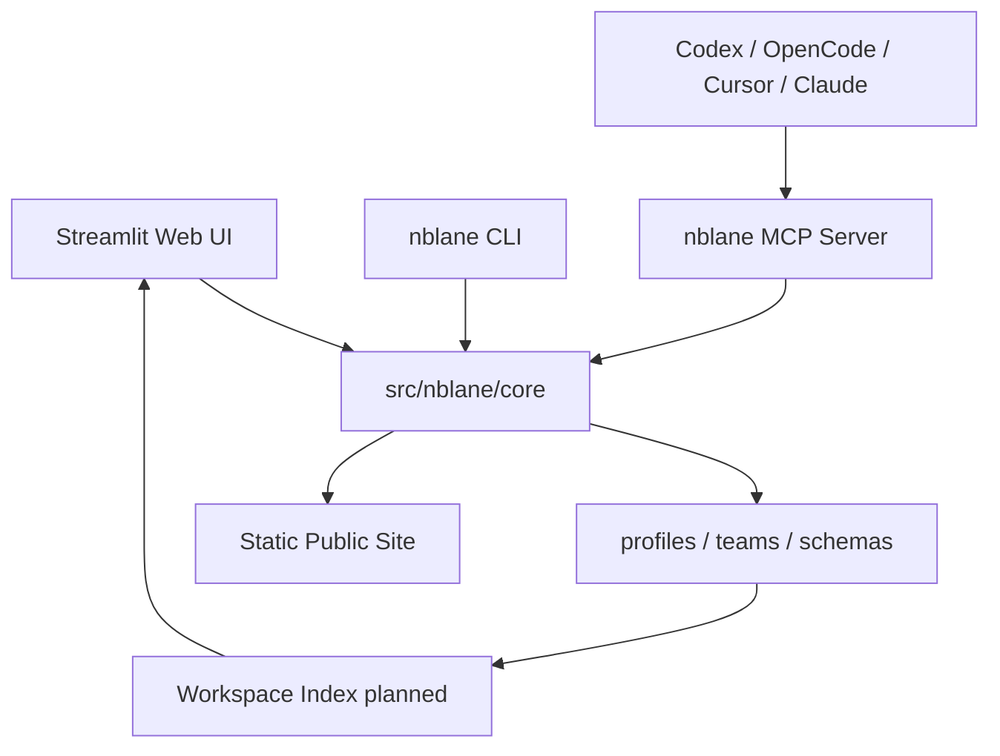
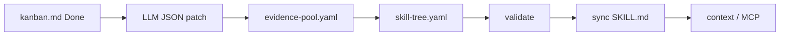
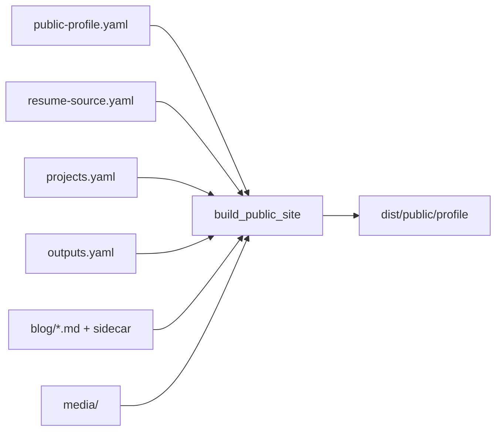
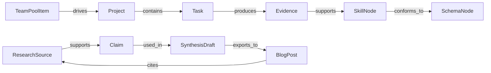

# 模块总览图

## 系统层级

## 当前核心闭环

## Public Surface

## 规划中的 typed graph

## 模块到对象映射

| 对象 | 当前模块 | 规划模块 |
|------|----------|----------|
| Profile | `profile_io.py` | `workspace_index.py` |
| SkillNode / Evidence | `models.py`、`evidence_resolve.py`、`profile_io.py` | `workspace_index.py` |
| KanbanTask | `kanban_io.py`、`kanban_events.py`、`kanban_ai.py` | `project_board.py`、`workspace_index.py` |
| Public Blog | `public_site.py`、`ai_dispatcher.py`、`ai_blog_reviewer.py` | `research.py`、`source_aware_blog.py` |
| ResearchSource / Claim | 未落地 | `research_sources.py` |
| Project / Milestone | 未落地 | `project_board.py` |
| AI Task | `llm.py` + scattered prompts | `core/ai/` |
| Agent Harness | `cursor_rule.py` 初版 | `agent_harness.py` |

## 视图原则

视图只读取索引，不成为新事实源：

- Table view：按属性过滤和排序。
- Board view：按状态/项目分组。
- Graph view：对象关系图。
- Project view：project -> milestone -> task -> evidence。
- Research matrix：source -> claim -> draft。
- Publication readiness：blog/project/output 的公开风险和出处覆盖。
