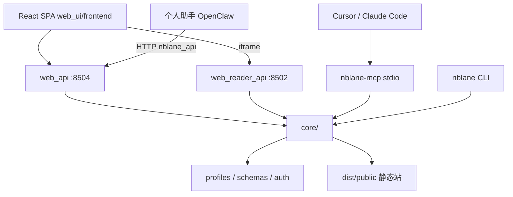

# 模块地图

按 `src/nblane/` 现有模块列出职责。运行时关系见 [架构总览](overview.md)，文件不变量见 [数据契约](data-contracts.md)。

## 系统层级

```mermaid
flowchart TB
  SPA[React SPA web_ui/frontend]
  Assistant[个人助手 OpenClaw]
  Editor[Cursor / Claude Code]
  CLI[nblane CLI]

  API[web_api :8504]
  Reader[web_reader_api :8502]
  MCP[nblane-mcp stdio]

  Core[core/]
  Files[profiles / schemas / auth]
  Public[dist/public 静态站]

  SPA --> API
  SPA -->|iframe| Reader
  Assistant -->|HTTP nblane_api| API
  Editor --> MCP
  API --> Core
  Reader --> Core
  MCP --> Core
  CLI --> Core
  Core --> Files
  Core --> Public
```

## 入口层

| 模块 | 职责 |
|------|------|
| `cli.py`、`commands/` | CLI：profile、evidence、ingest、public、research、health、backup、agent、codex、openclaw、integration |
| `web_api/__init__.py` | `create_app`：挂 Agent 写入守卫、`GitActorMiddleware`、各 router，最后挂 SPA |
| `web_api/routes_v1.py` | 大部分 `/api/v1` 路由：档案、首页、目标、项目 / 看板、技能树、证据、结晶、内容、求职、公开站、jobs、撤销日志 |
| `web_api/schemas.py` | pydantic 请求 / 响应模型（OpenAPI 契约源） |
| `web_api/auth.py` | 登录、cookie 会话、限流、profile 作用域、管理员校验 |
| `web_api/agent_guard.py` | 路由 → Agent 动作映射与统一拦截 |
| `web_api/assistant.py`、`agents_setup.py` | 助手页状态、接入方式；助手安装 / 接入 / 迁移与备份设置 |
| `web_api/research.py`、`research_papers.py` | 研究台、论文概览与 SPA 侧论文操作 |
| `web_api/workshop.py`、`workshop_terminal.py` | 车间终端托管设置；`/terminal/*` 认证反代 ttyd |
| `web_api/local_models.py`、`grobid.py` | 本地翻译模型、GROBID 托管设置 |
| `web_api/jobs.py` | 进程内 jobs + SSE 事件流 |
| `web_api/spa.py` | 服务 `web_ui/static`，客户端路由回退到 `index.html` |
| `web_reader_api/` | 论文库、阅读器页面与其 API、`/auth/session` |
| `mcp_server.py` | 本机 MCP resources / tools（复用 Agent 策略） |

## core/ 按领域

| 领域 | 模块 |
|------|------|
| 文件 I/O 与并发 | `profile_io.py`、`schema_io.py`、`kanban_io.py`、`yaml_io.py`、`io.py`（兼容门面）、`file_write.py`、`file_lock.py`、`file_state.py`、`paths.py`、`models.py` |
| 技能树与 SKILL.md | `validate.py`、`sync.py`、`context.py`、`profile_context.py`、`north_star.py`、`growth_log.py`、`skill_progression.py`、`skill_tree_edit.py`、`skill_evidence_inline.py`、`status.py` |
| 证据 | `evidence_resolve.py`、`evidence_ops.py`、`evidence_pool_id.py`、`evidence_review.py`、`evidence_dedup.py`、`evidence_migrate.py`、`evidence_from_output.py`、`crystallize.py`、`claims.py`、`interaction.py`、`profile_health.py`（证据「待补强」） |
| 摄入 | `ingest_parse.py`、`ingest_merge.py`、`ingest_preview.py`、`ingest_apply.py`、`ingest_models.py`、`profile_ingest_llm.py`、`profile_ingest.py`（兼容门面） |
| 首页与目标 | `starmap_snapshot.py`、`home_dashboard.py`、`goals.py`、`goal_alignment.py`、`divination.py`、`daily_brief.py`、`chronicle.py`、`growth_graph_contract.py`、`workspace_graph.py`、`command_bar.py`、`intent.py` |
| 项目与看板 | `projects_board.py`（/projects 聚合读模型）、`project_board.py`、`project_board_sync.py`、`project_board_events.py`、`project_suggest.py`、`kanban_merge.py`、`kanban_archive.py`、`kanban_events.py`、`kanban_ai.py`、`task_intake.py`、`activity_log.py`（打卡 / 习惯 / 阶段计划）、`plan_templates.py`、`experience.py` |
| 研究 | `research_workspace.py`、`research_sources.py`、`research_connectors.py`、`research_papers/`、`paper_library_workspace.py`、`reader_actions.py`、`reader_tasks.py`、`learning_log.py`、`local_dict.py`、`grobid_service.py` |
| 内容、求职、公开站 | `content_workspace.py`、`content_ai.py`、`career_workspace.py`、`career_ai.py`、`resume_doc.py`、`resume_extract.py`、`jd_match.py`、`public_site.py`、`public_console.py`、`public_curation.py`、`visual_generation.py`、`visual_candidate_store.py`、`ai_blog_outline.py`、`ai_blog_reviewer.py`、`ai_dispatcher.py`、`blog_workspace.py` |
| AI | `ai/`（gateway、router、backends、structured、prompts、runs、exceptions、skill_suggest、local_models、local_translation）、`llm.py`、`jsonutil.py`、`codex_adapter.py`、`agent_tasks.py`、`agent_activity.py`（AI 候选与失败记录） |
| Agent | `agent_policy.py`、`agent_ops.py`、`agent_journal.py`、`openclaw_setup.py`、`openclaw_ops.py`、`openclaw_corpus.py`、`openclaw_automations.py`（可选手动同步）、`notify.py`、`mcp_client_config.py`、`cursor_rule.py` |
| 账号、设置、备份 | `auth.py`、`web_preferences.py`、`git_backup.py`、`backup_targets.py`、`workshop_service.py`、`tag_taxonomy.py` |
| 内部匹配 | `gap.py`、`gap_llm_router.py`、`learned_keywords.py`：技能匹配与任务路由，供技能建议、任务引入等复用；Gap 页面已移除 |

## 前端

| 位置 | 内容 |
|------|------|
| `web_ui/frontend/src/App.tsx` | 路由与旧路由重定向 |
| `src/components/AppLayout.tsx` | 左栏导航、顶栏（车间、助手、AI 异常、设置、退出） |
| `src/pages/` | 各页面；`settings/` 为设置分区 |
| `src/starmap/` | 首页 Three.js 星图、星表、占卜、习惯印、铭文卡 |
| `src/components/{projects,content,career,publicSite,settings}` | 各功能区组件 |
| `src/api/` | fetch 封装、TanStack Query hooks、生成的 `schema.d.ts` 与 `types.ts` |
| `src/theme.ts` | 设计 token，深色锁定 |

## 待删遗留

| 模块 | 说明 |
|------|------|
| `app.py`、`pages/`、`.streamlit/`、`web_shared.py`、`web_cache.py`、`web_auth.py`、`web_page_shell.py`、`web_output_studio.py`、`web_public_build.py`、`web_linkify.py`、`web_i18n.py`、`kanban_ui/`、`research_ui/`、`evidence_editor_host.py`、`kanban_ai_jobs.py`、`core/ai_stream_tasks.py`、`*_component/` | Streamlit 遗留，待删，勿改。删除前注意：Reader API 仍引用 `web_i18n.py`、`research_paper_reader_component.events` 与 `paper_library_component` 前端产物；CI import smoke 仍引用 `kanban_ui` |
