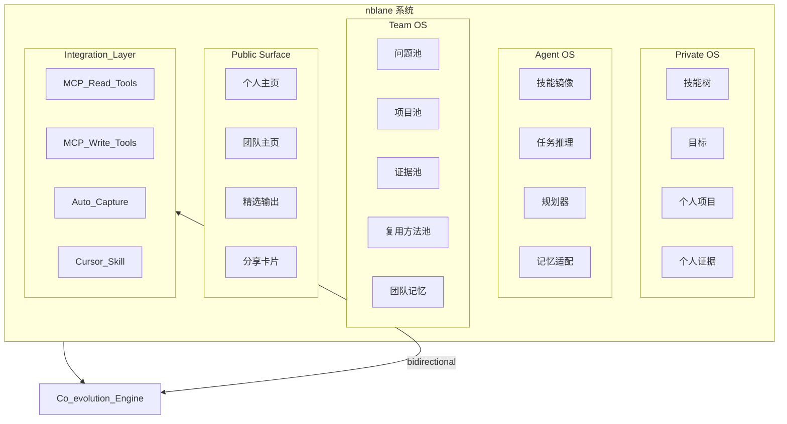
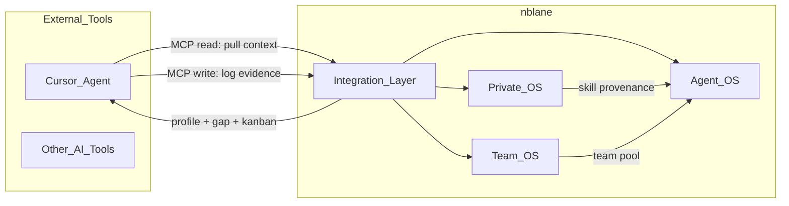
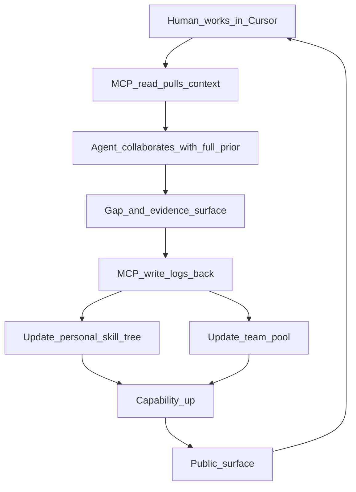
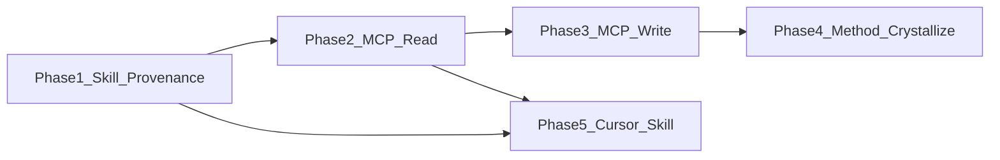

# nblane · 产品设计

**Human + Agent + Team 共进化系统**

工程导向的产品定义：人在系统中不是单独工作，Agent 也不是一次性工具。
nblane 把 **人、Agent、团队协作** 一起纳入同一个长期操作系统。

| 项目 | 当前值 |
|------|--------|
| 产品版本 | `v0.2` |
| 文档修订 | `v0.2.5` |
| 状态 | 活跃草稿 |
| 最近更新 | `2026-03-22` |

---

## 1. 核心定义

### 一句话（必须成立）

> **nblane 是一个让「人类能力」与「Agent 能力」共同进化，并让多个
> Human + Agent 单元在团队中持续复利的操作平台。**

### 最小单元

nblane 的原子单元不是单独的人，也不是孤立的 Agent，而是：

```text
Human + Agent = 一个长期共进化单元
多个单元 + 共享产品池 = 一个长期复利团队
```

### 为什么要加团队层

一个人走得快，但一群人走得远。

产品上，这句话不该只是价值观，而要变成系统结构：

- 个人要持续变强
- Agent 要持续更懂人
- 团队要持续共享问题、项目、证据与方法
- 组织能力不能只存在于聊天记录里，必须沉淀进共享产品池

### 三个对等主体

```text
Human（你） ── 共进化 ── Agent（你的 AI 对应体）
      \                           /
       \────── 协作沉淀 ──────/
                Team
```

### 三者差异

| 维度 | Human | Agent | Team |
|------|-------|-------|------|
| 优势 | 真实经验、判断、创造力 | 知识广度、推理速度、执行密度 | 多角色互补、长期复利、规模化协作 |
| 劣势 | 记忆有限、带宽有限 | 不知道“你是谁”就无法真正贴身协作 | 容易碎片化、重复劳动、知识散落 |
| 在 nblane 中的作用 | 形成真实成长 | 形成个性化增强 | 形成共享产能与组织记忆 |

---

## 2. 北极星与产品目标

### 北极星（不变）

```text
成为领域顶尖。
```

### 新的增长公式

```text
不只是：
Human ↑
Agent ↑
Human + Agent ↑↑

而是进一步：
(Human + Agent) × Team ↑↑↑
```

### 产品级结果

nblane 不只帮助你完成任务，还应沉淀出四类长期资产：

- **Private OS**：你自己的成长系统
- **Agent OS**：持续理解你、代表你、协助你的长期 Agent
- **Team OS**：团队共享的产品池、协作协议与组织记忆
- **Public Surface**：可分享的个人或团队页面，用于展示方向、项目、证据与影响力

### 必须满足的结果标准

- 用户不是只完成一次任务，而是能力被持续校准
- Agent 不是只回答问题，而是越来越懂具体的人与团队
- 团队不是只做即时协作，而是共享资产越积越厚
- 输出不是只停留在内部，而是能转化为对外可理解的作品、证据与页面

---

## 3. 产品原则

### 3.1 原子单元优先

先把单个 `Human + Agent` 单元建立起来，再让多个单元连接成团队。
如果单体不成立，团队层一定是空的。

### 3.2 项目优先于聊天

真正能沉淀能力的，不是对话本身，而是围绕问题、项目、证据和复盘形成的结构化记录。

### 3.3 证据优先于口号

技能、判断、影响力都要尽可能落到项目、输出、证据和版本历史上。

### 3.4 默认私有，按块共享

个人上下文默认私有；团队共享、公开发布都以块为单位控制。

### 3.5 人类最终负责

Agent 可以主动、可以协作、可以生成，但关键意图、关键决策、关键发布永远由 Human 负责。

### 3.6 团队不是聊天室，而是复利机器

团队层最重要的不是消息流，而是：

- 共享问题池
- 共享项目池
- 共享证据池
- 共享方法池
- 共享上下文与复盘

### 3.7 技能必须有出处（Skill Provenance）

每一项技能的状态变更，都应能追溯到具体的产出——项目、论文、代码、实验、
专利等。没有出处的技能标签只是口号；有出处的技能树才是真正的能力证明。

### 3.8 双向集成优先于单向输出

nblane 不只是给 LLM 喂 prompt 的文件仓库，而是外部 AI 工具可以主动拉取
上下文、回写活动记录的双向服务。集成接口是一级产品能力，不是附属功能。

---

## 4. 理想用户

### 4.1 首批理想用户

nblane 的第一批理想用户，不是泛大众，而是：

- 已理解大模型、Agent、上下文、提示词等基本范式
- 想成为 **AI-native researcher / engineer / builder**
- 不满足于把 AI 当作一次性问答工具
- 愿意长期维护自己的 prior、项目与证据
- 希望同时提升能力、产出、团队协作效率与公开影响力

### 4.2 理想团队画像

最适合 nblane 的团队通常有以下特征：

- 小而强，通常是研究型、工程型或产品型团队
- 每个人能力不同，但围绕同一问题域协作
- 已经在使用 AI，但协作资产仍散落在聊天、文档、代码和脑内
- 希望把“谁懂什么、谁做过什么、下一步该做什么”变成可持续系统

### 4.3 不优先的人群

- 只想要一个轻量待办工具的人
- 不愿记录长期上下文的人
- 希望一键代劳、但不愿审阅与共建的人
- 只想做短期协作，不关心长期资产沉淀的团队

---

## 5. 系统结构

### 5.1 五层结构



纯文本对照：

```text
┌───────────────────────────────────────────────────────────────────┐
│                         nblane System                             │
├────────────┬────────────┬──────────────┬──────────┬───────────────┤
│ Private OS │ Agent OS   │ Team OS      │ Public   │ Integration   │
│            │            │              │ Surface  │ Layer         │
├────────────┼────────────┼──────────────┼──────────┼───────────────┤
│ Skill Tree │ Skill Mirr │ Problem Pool │ Personal │ MCP Read      │
│ Goals      │ Reasoner   │ Project Pool │ Team Pg  │ MCP Write     │
│ Projects   │ Planner    │ EvidencePool │ Selected │ Auto-capture  │
│ Evidence   │ Memory     │ Team Memory  │ Cards    │ Cursor Skill  │
└────────────┴────────────┴──────────────┴──────────┴───────────────┘
                                │
                                ▼
                       Co-evolution Engine
                         (bidirectional)
```

### 5.2 结构关系

- `Private OS` 负责“我是谁、我在长什么”
- `Agent OS` 负责“系统如何理解我、协助我、代表我”
- `Team OS` 负责“多个单元如何共享产品池并形成组织复利”
- `Public Surface` 负责“内部资产如何转化为外部可理解的影响力”
- `Integration Layer` 负责“外部 AI 工具如何读写 nblane 数据”

### 5.3 Integration Layer 职责

Integration Layer 是 nblane 与外部 AI 工具（Cursor、其他 Agent 框架）的
双向接口层。它不是 v1.0 才考虑的附属功能，而是从 v0.2 开始就应定义的
一级产品能力。

**Read Path（外部工具拉取 nblane 上下文）：**

- 用户画像摘要（技能树、当前焦点、工作偏好）
- 当前任务状态（kanban、活跃项目）
- 能力缺口分析（对指定任务的 gap analysis）
- 团队上下文（共享产品池、团队优先级）

**Write Path（外部工具回写活动到 nblane）：**

- 记录技能实践证据（skill_id + evidence 引用）
- 更新项目进展
- 追加成长日志
- 触发技能状态变更建议

**暴露方式：**

- MCP Server（首选）：通过 Model Context Protocol 暴露 tools 和 resources
- Cursor Skill：作为 Cursor 的 agent skill 被自动加载
- CLI pipe：兼容命令行工具链

---

## 6. Agent 角色：不是工具，是“第二个你”

| 角色 | 含义 |
|------|------|
| **Skill Mirror（技能镜像）** | Agent 知道你会什么、不会什么。 |
| **Task Reasoner（任务推理器）** | Agent 判断你是否能完成某项任务。 |
| **Growth Partner（成长伙伴）** | Agent 推动你补齐短板。 |
| **Memory Adapter（记忆适配器）** | Agent 长期保留你的轨迹。 |
| **Team Interface（团队接口）** | Agent 把个人上下文翻译为团队可协作的信息。 |

这些不是五个孤立按钮，而是 Agent OS 的长期责任：

- 先理解你
- 再判断任务
- 再连接团队资源
- 然后协作推进
- 最后把结果写回长期记忆与共享产品池

---

## 7. 数据形态

### 7.1 Human profile（人类侧）

```json
{
  "skills": [
    {
      "name": "3D Perception",
      "level": 4,
      "evidence": [
        {"type": "project", "ref": "6D Pose Module", "date": "2025-06"},
        {"type": "paper", "ref": "Robust 6D Pose under Occlusion", "date": "2025-09"}
      ]
    },
    {
      "name": "World Model",
      "level": 1,
      "evidence": []
    }
  ],
  "goals": ["Become VLA expert"],
  "projects": [],
  "evidence": []
}
```

每项技能内嵌 `evidence` 列表，记录证明该技能的具体产出（项目、论文、
代码、实验、专利等）。没有 evidence 的技能仍可存在，但 Agent 在判断
技能深度时会降低置信度。这是 Skill Provenance 原则（3.7）的数据落地。

### 7.2 Agent profile（Agent 侧）

```json
{
  "understanding_of_user": {
    "strengths": ["perception"],
    "weaknesses": ["world model"],
    "current_focus": ["VLA"]
  },
  "working_style": {
    "prefers": ["structured plans", "evidence-backed decisions"],
    "avoids": ["vague delegation"]
  },
  "confidence": 0.7
}
```

Agent 不是简单复制你，而是**建模它对你的理解**，并形成稳定协作接口。

### 7.3 Shared context（任务桥梁）

```json
{
  "current_task": "Design VLA model",
  "required_skills": ["VLA", "world model"],
  "gap_detected": ["world model"],
  "recommended_support": ["paper review", "baseline implementation"]
}
```

### 7.4 Team profile（团队侧）

```json
{
  "team_name": "Embodied AI Lab",
  "shared_focus": ["VLA", "embodied intelligence"],
  "members": ["narwal", "alice", "bob"],
  "shared_rules": [
    "private by default",
    "evidence before opinion",
    "humans approve public release"
  ],
  "current_priorities": ["robot data engine", "world model eval"]
}
```

### 7.5 Shared product pool（共享产品池）

```json
{
  "problem_pool": [
    "How to build a robust VLA baseline?"
  ],
  "project_pool": [
    "VLA Model Design",
    "Data Engine Prototype"
  ],
  "evidence_pool": [
    {
      "title": "6D Pose ablation on occlusion",
      "type": "experiment",
      "linked_skills": ["pose_estimation"],
      "linked_project": "6D Pose Module",
      "author": "narwal",
      "date": "2025-08"
    },
    {
      "title": "VLA baseline benchmark v1",
      "type": "benchmark",
      "linked_skills": ["vlm_robot", "imitation_learning"],
      "linked_project": "VLA Model Design",
      "author": "alice",
      "date": "2026-01"
    }
  ],
  "method_pool": [
    "prompt template",
    "evaluation checklist",
    "experiment playbook"
  ]
}
```

共享产品池是团队层最关键的新对象。
它不是简单文件夹，而是团队对“正在解决什么、已经验证什么、可以复用什么”的统一视图。

证据池中的每条记录通过 `linked_skills` 和 `linked_project` 与个人技能树和项目池
双向索引。这让团队证据与个人 Skill Provenance 形成统一的知识图谱。

### 7.6 Public profile（公开展示面）

```json
{
  "headline": "AI-native team building VLA systems",
  "current_focus": ["VLA", "embodied intelligence"],
  "featured_projects": ["VLA Model Design"],
  "public_evidence": ["demo", "blog", "paper note"],
  "share_url": "https://example.com/team/embodied-ai"
}
```

---

## 8. 共进化引擎

### 8.1 单向闭环已不够

旧版共进化引擎只描述了概念闭环：人做任务 → Agent 协作 → 发现缺口 → 更新。
这条路径只有一个输入源（人编辑文件）和一个输出口（`nblane context` 生成 prompt）。
实际场景中，用户在 Cursor 中开发，Agent 应当能：

- 主动拉取用户上下文（而不是每次由用户手动解释“我是谁”）
- 在协作过程中自动将成果写回 nblane（而不是等用户手动整理）

### 8.2 双向技术闭环



纯文本对照：

```text
←←← Read Path ←←←              →→→ Write Path →→→
Cursor ←─ MCP read ── nblane     Cursor ── MCP write ─→ nblane
  │    (profile, gap,         │    (evidence, log,
  │     kanban, team)          │     project update)
  │                            │
  └── Agent 已知道用户       └── 结果自动沉淀
      是谁、在做什么、          到 skill-tree
      缺什么                     和 evidence
```

### 8.3 个人闭环（含 MCP）

```text
输入：任务（用户在 Cursor 中开始工作）
  → Cursor Agent 通过 MCP read 拉取 nblane 上下文
  → Agent 推断所需技能
  → 与 Human 技能树对比（含证据深度）
输出：
  - 能做什么（有证据支撑）
  - 不能做什么（无证据或证据不足）
  - 需要什么支持
回写：
  - 通过 MCP write 记录技能实践证据
  - 通过 MCP write 更新项目进展
```

### 8.4 团队闭环（含 MCP）

```text
输入：多个成员的任务与上下文
  → Agent 汇总缺口、依赖、重复劳动
  → 对接团队共享产品池
输出：
  - 谁最适合做（基于个人 skill + evidence 判断）
  - 哪些资产可复用
  - 哪些结果应沉淀到团队池子
回写：
  - 将证据写入团队 evidence_pool（含 linked_skills）
  - 将方法写入 method_pool
```

### 8.5 双层更新

发现缺口后，写入两个层次：

- **个人层**：技能树（含 evidence 更新）、焦点、Agent prior、下一步建议
- **团队层**：问题池、项目池、证据池（结构化）、方法池、团队记忆

### 8.6 完整数据流



纯文本：

```text
Human 在 Cursor 中工作
  → MCP read 拉取 nblane 上下文
  → Agent 带着完整 prior 协作
  → 发现缺口 + 产生证据
  → MCP write 回写 nblane
  → 更新个人技能树（含 evidence）
  → 更新团队共享产品池
  → 能力与组织产能提升
  → 对外呈现
  （循环）
```

---

## 9. 项目驱动：从双主体到团队协作

### 9.1 项目形态

```json
{
  "name": "VLA Model Design",
  "owner": "team",
  "operators": ["human", "agent"],
  "required_skills": ["VLA", "world model"],
  "linked_pool_items": ["baseline", "eval checklist"],
  "status": "ongoing"
}
```

### 9.2 分工原则

| 阶段 | Human | Agent | Team |
|------|-------|-------|------|
| 定义问题 | 主导 | 辅助推理 | 对齐优先级 |
| 方案设计 | 协作 | 协作 | 提供历史方案与约束 |
| 实现 | 协作 | 协作 | 分配模块与复用资产 |
| 复盘 | 判断与决策 | 主导分析 | 沉淀到共享产品池 |

### 9.3 默认协作方式

实现阶段默认 **结对交付**：

- Agent 可承担写代码、查资料、改配置、补测试、起草文档
- Human 负责意图、关键决策、审阅与合入
- Team 负责上下文复用、资产同步、优先级协调与知识沉淀

### 9.4 项目不是孤岛

在 nblane 里，一个项目必须尽量连回四件事：

- 它解决了哪个问题池中的问题
- 它复用了哪些共享方法或证据
- 它暴露了哪些新的能力缺口
- 它完成后应向共享产品池回写什么

### 9.5 方法结晶：从工作过程到可复用知识

设想这样一个场景：你在复现一个 VLA 算法。过程中你遇到了硬件问题、
依赖冲突、数据格式问题、模型配置问题。有些你自己查资料解决，有些问了
Cursor。最终工作完成了。那些艰难获得的知识去了哪里？

没有 nblane，它们消失在聊天记录和记忆里。有了 nblane，项目应当
**结晶**为三种输出：

**1. 结构化方法（playbook）**

```json
{
  "title": "在 Piper 臂上复现 PI0.5",
  "source_project": "VLA 复现",
  "problems_encountered": [
    {"domain": "hardware", "problem": "USB 延迟",
     "solution": "改用直连串口", "source": "self-research"},
    {"domain": "code", "problem": "action space 不匹配",
     "solution": "归一化到 [-1,1]",
     "source": "cursor-interaction"}
  ],
  "steps": ["…有序步骤…"],
  "prerequisites": ["ROS2 basics", "imitation_learning"],
  "author": "narwal",
  "date": "2026-03"
}
```

**2. 技能证据（per-skill provenance）**

每个问题-解决方案对映射到一个或多个技能节点。解决 USB 延迟问题是
`real_robot_ops` 的证据；修复 action space 不匹配是 `imitation_learning`
的证据。这些会流入对应技能的 `evidence` 列表。

**3. 团队可复用资产**

方法进入团队的 `method_pool`；问题-解决方案对（含 `linked_skills`）
进入 `evidence_pool`。下次团队中任何人需要复现 VLA 模型时，
playbook 已经在那里。

**原材料的两个来源：**

- **人类主动记录**：用户显式记录关键决策、灵感时刻和教训。
  这是高信号来源。
- **Agent 交互日志**：用户向 Cursor 提出的问题、Agent 帮助解决的
  问题、Agent 建议的代码变更。这是高容量来源。nblane 应当捕获
  并结构化这些交互，形成候选的问题-解决方案对。

**结晶流程：**

```text
项目进行中
  → Human 解决问题（自己查资料）
  → Human 向 Agent 求助（交互日志被捕获）
  → 项目完成
  → Agent 综合分析：
      - 问题-解决方案对（来自两个源）
      - 有序步骤（playbook）
      - 技能证据（映射到技能节点）
  → Human 审查并确认
  → 方法写入 method_pool
  → 证据写入个人技能树 + 团队 evidence_pool
```

核心洞察：**做工作的过程本身就是方法的原材料。
你不应该需要在完成工作之后再另外写一遍方法。**

---

## 10. 团队协作与共享产品池

这是本次产品定义优化的新增重点。

### 10.1 为什么团队一定要有共享产品池

没有共享产品池，团队就会出现以下问题：

- 同样的问题被不同人重复研究
- 结论散落在聊天、会议和脑内
- 新成员不知道从哪里接上
- Agent 只能理解个人，无法理解团队整体状态

共享产品池的意义，是把团队的协作对象显式化。

### 10.2 池子里应该放什么

共享产品池至少包括：

- **Problem Pool**：团队正在追的关键问题
- **Project Pool**：围绕问题展开的项目与实验
- **Evidence Pool**：结论、实验、demo、评测、引用材料
- **Method Pool**：提示词模板、评审清单、实验流程、工作流
- **Decision Pool**：关键决策及其原因

### 10.3 团队层的产品价值

团队层不是为了“多人在线协同”这种表层功能，而是为了让团队获得三种能力：

- **共同对焦**：大家知道最重要的问题是什么
- **共同记忆**：历史判断和证据不会轻易丢失
- **共同放大**：一个人的发现能快速转化为团队的可复用资产

### 10.4 团队协作最小流程

```text
个人产生任务 / 想法
  → Agent 判断是否关联团队问题
  → 命中后写入共享产品池
  → 团队分配与复用已有资产
  → 产出结果
  → 结果回写团队池
```

### 10.5 权限与边界

- 个人 prior 默认私有
- 团队池默认团队可见
- 公开内容必须显式发布
- 敏感上下文不自动进入公开面
- 任何“代表团队发声”的内容都需要明确的人类负责人

---

## 11. 公开主页与分享机制

这是产品从“内部成长系统”走向“对外影响力系统”的关键层。

### 11.1 为什么必须有

- 成长不仅要发生，还要能被理解
- 项目不仅要完成，还要能被展示
- 团队不仅要协作，还要能形成清晰外部认知

### 11.2 公开面应展示什么

个人与团队的公开面可以共用一套结构：

- North Star / 一句话定位
- 当前研究或工程方向
- 技能或能力摘要
- 代表性项目
- 可公开证据
- 最近的重要更新
- 与 Agent 协作形成的精选输出

### 11.3 生成流程

```text
私有资料（profile / project / evidence / team pool）
  → Agent 整理与提炼
  → Human 审核
  → 生成个人页或团队页
  → 对外分享
```

### 11.4 发布原则

- 默认私有
- 按块公开
- 可生成分享链接
- 公开内容始终由 Human 最终确认

---

## 12. 社交、连接与个人 / 团队 IP

### 12.1 社交

常见痛点不是“没有社交平台”，而是不知道该连接谁、为什么连接、连接后说什么。

nblane 的思路是：让 Agent 基于个人与团队上下文，分析谁在做相近问题、谁值得连接、如何开口。

示例：

```json
{
  "suggested_connections": [
    {
      "target": "researcher_x",
      "reason": "working on VLA evaluation",
      "action": "share ablation note and ask for feedback"
    }
  ]
}
```

### 12.2 个人 IP

转变：

- 从：人写一切
- 到：Agent 放大你的影响力

### 12.3 团队 IP

进一步转变：

- 从：团队每次都重新解释自己
- 到：团队自动维护一套持续更新的外部形象

流程：

```text
你或团队交付项目
  → Agent 提炼观点
  → 起草（博客 / 页面 / 线程 / 更新）
  → Human 审核
  → 发布
```

个人页解决“我是谁”，团队页解决“我们在一起解决什么问题”。

---

## 13. 集成架构与自动捕获

本章补充产品对“外部集成”和“自动捕获”的定义。

### 13.1 nblane 作为 MCP Server

nblane 应作为一个 MCP Server 运行，向 Cursor 等外部 AI 工具暴露
以下 MCP tools 和 resources：

**MCP Resources（只读上下文）：**

| Resource URI | 返回内容 |
|--------------|----------|
| `nblane://profile/{name}/summary` | 技能树摘要 + 当前焦点 + 工作偏好 |
| `nblane://profile/{name}/kanban` | 当前任务板 |
| `nblane://profile/{name}/gap?task=X` | 针对任务 X 的能力缺口分析 |
| `nblane://team/{id}/pool` | 团队共享产品池 |

**MCP Tools（可写操作）：**

| Tool | 参数 | 作用 |
|------|------|------|
| `log_skill_evidence` | skill_id, type, ref, date | 记录一次技能实践证据 |
| `update_project_progress` | project, status, note | 更新项目进展 |
| `append_growth_log` | name, event | 追加成长日志 |
| `suggest_skill_upgrade` | skill_id, new_status | 建议技能状态变更（需 Human 确认） |

### 13.2 Cursor Skill 集成

nblane 可以作为 Cursor 的 agent skill 被加载。加载后，Cursor Agent
在每次会话开始时自动获得用户上下文，无需用户手动解释背景。

典型场景：

```text
用户在 Cursor 中打开项目
  → nblane skill 自动注入用户画像
  → Agent 知道用户的技能、缺口、工作偏好
  → 给出更有针对性的反馈
  → 尤其是在项目分析阶段，能结合能力缺口给出更精准的反馈
```

### 13.3 自动捕获机制

不应该只依赖用户手动编辑文件来更新技能树。通过 MCP write tools，
外部工具可以在用户工作过程中自动捕获技能实践：

**捕获触发点：**

- 用户完成一次代码提交（涉及特定技能域）
- 用户完成一次代码审查
- 用户成功解决一个复杂问题
- Agent 观察到用户在某领域反复实践

**捕获流程：**

```text
开发活动发生
  → Agent 识别涉及的技能节点
  → 通过 MCP write 调用 log_skill_evidence
  → 证据写入 skill-tree.yaml 对应节点
  → 当证据累积足够时，建议状态升级
  → Human 确认后执行升级
```

**安全原则：**

- 证据自动写入，但技能状态升级必须由 Human 确认
- 所有自动捕获的内容对用户可见、可审查、可撤回
- 不自动将敏感内容写入团队池或公开面

### 13.4 交互日志作为知识来源

你向 Cursor 提的每一个问题，不是一次性的聊天——它是知识的原材料。
nblane 应当将 Agent 交互捕获为结构化日志：

```json
{
  "session_id": "abc123",
  "project": "VLA 复现",
  "interactions": [
    {
      "timestamp": "2026-03-20T14:30:00Z",
      "question": "action space 与机器人不匹配",
      "domain": "imitation_learning",
      "resolution": "将 action 归一化到 [-1,1]",
      "resolved_by": "agent"
    },
    {
      "timestamp": "2026-03-20T16:10:00Z",
      "question": "USB 延迟导致丢帧",
      "domain": "real_robot_ops",
      "resolution": "改用直连串口",
      "resolved_by": "human"
    }
  ]
}
```

这个日志有三个用途：

- **方法原材料**：项目完成时，Agent 将交互综合成结构化 playbook
  （见 9.5）
- **技能证据**：每个解决的问题映射到技能节点，成为 Skill Provenance
- **Agent 记忆**：Agent 学习用户容易遇到什么问题、偏好如何解决

**交互日志相关 MCP tool：**

| Tool | 参数 | 作用 |
|------|------|------|
| `log_interaction` | project, question, domain, resolution, resolved_by | 记录一次 Agent 会话中的问题-解决方案对 |
| `crystallize_method` | project, human_confirms | 将所有交互 + 手动日志综合生成结构化 playbook |

---

## 14. 核心能力（必须做）

| 函数 | 作用 | 接口方式 |
|------|------|----------|
| `can_solve(task)` | 判断个人当前能否完成任务 | CLI + MCP resource |
| `detect_gap(task)` | 检测能力或资源缺口 | CLI + MCP resource |
| `suggest_next_action()` | 给出最合理的下一步 | CLI + MCP resource |
| `update_both(human, agent)` | 更新个人与 Agent | CLI + MCP tool |
| `log_skill_evidence()` | 记录技能实践证据 | MCP tool |
| `log_interaction()` | 记录 Agent 会话中的问题-解决方案对 | MCP tool |
| `crystallize_method()` | 将工作过程综合生成结构化 playbook | CLI + MCP tool |
| `sync_team_pool()` | 将有价值的结果写入共享产品池 | CLI + MCP tool |
| `route_to_best_owner()` | 判断任务最适合由谁负责 | CLI + MCP resource |
| `build_public_profile()` | 生成个人或团队公开资料 | CLI |
| `select_public_evidence()` | 筛选可公开证据 | CLI |
| `generate_share_page()` | 生成分享页面 | CLI |

以上为**产品契约**；每个函数明确标注了接口方式，使其不只是内部契约，
而是可被外部工具调用的接口契约。

---

## 15. 开源使命

> **nblane 的开源目标，不是做一个通用效率工具，而是耐心地帮助每个人、
> 每个团队拥有自己的长期 AI 协作系统。**

这个系统会越来越懂个人，也越来越懂团队，最终形成可持续的长期复利。

### 为什么开源

- 让每个人都能拥有自己的长期 Agent，而不是依赖封闭平台
- 让 prior、成长记录、项目证据与团队记忆属于用户自己
- 让社区共同探索 AI-native researcher / engineer / team 的工作方式

### 开源项目的真正爆点

不是单一技能树，也不是单一 Agent，而是五者合一：

- 长期个人成长记录
- 长期 AI 分身
- 长期团队共享产品池
- 可分享的个人与团队影响力界面
- 双向集成接口，让 AI 工具能读写你的成长系统

---

## 16. MVP 路线图

### v0.1（已完成）

- Human profile
- 技能树
- 简单 gap 检测

### v0.2（当前）

- Agent profile
- 任务分析
- 双向更新
- Skill Provenance：技能节点支持结构化证据链接

### v0.3

- MCP Server：nblane 作为 MCP Server 向外部工具暴露 read/write 接口
- Cursor Skill 集成：作为 Cursor agent skill 自动加载用户上下文
- 自动捕获：通过 MCP write 自动记录技能实践证据

### v0.4

- 共享产品池
- 团队协作视图
- 个人页 / 团队页
- 公开证据筛选与分享链接

### v1.0

- 更稳定的长期记忆与自动化闭环
- 团队协作与公开展示全链路成熟
- 多 AI 工具集成（不只是 Cursor）

---

## 17. 版本管理

版本管理分两层：**产品版本** 与 **文档版本**。

### 17.1 产品版本

产品版本用 `vMAJOR.MINOR`：

- `v0.1`：Human OS 基础版
- `v0.2`：Human + Agent 双系统 + Skill Provenance
- `v0.3`：MCP Server + Cursor 集成 + 自动捕获
- `v0.4`：Team OS + Public Surface
- `v1.0`：长期 AI 协作系统成型

### 17.2 文档版本

产品手册文档版本用 `vMAJOR.MINOR.PATCH`：

- `MAJOR`：产品定义发生根本变化
- `MINOR`：新增一级能力或重要章节
- `PATCH`：措辞、结构、示例、映射等小修订

### 17.3 当前变更记录

| 文档版本 | 说明 |
|----------|------|
| `v0.2.0` | 首版双系统产品手册 |
| `v0.2.1` | 补充目标用户、公开主页、开源使命、版本管理 |
| `v0.2.2` | 收紧核心定义，新增 Team OS 与共享产品池定义 |
| `v0.2.3` | 新增 Integration Layer、Skill Provenance、双向共进化引擎、自动捕获机制 |
| `v0.2.4` | 新增方法结晶（工作过程 → 可复用 playbook）、交互日志作为知识来源 |
| `v0.2.5` | Demo 1 扩展为完整个人 + Agent 交互闭环（5 阶段开发计划） |

### 17.4 升版规则

- 如果新增一个一级产品能力，例如“Team OS”或“公开展示层”，升 `MINOR`
- 如果只是修改表述、图示、示例，升 `PATCH`
- 每次产品版本升级，都应同步更新 MVP 与版本历史

---

## 18. 最小 Demo（下一构建目标）

### Demo 1：个人 + Agent 完整交互闭环

Demo 1 的目标不只是“判断能力”，而是走通个人与 Agent 交互的
完整闭环：从 Cursor 拉取上下文、带着 prior 协作、自动回写证据和方法。
所有组件运行在同一台机器上（本地 stdio 传输，不走网络）。

**完成后的端到端场景：**

```text
用户在 Cursor 中开始“复现 PI0.5 VLA 算法”
  → Cursor Agent 通过 MCP read 自动获取用户画像
     （技能树、缺口、当前任务、工作偏好）
  → Agent 知道用户 imitation_learning 还在 learning、
     但 pose_estimation 是 solid 且有论文证据
  → 给出更有针对性的反馈：重点解释 RL 部分，跳过感知基础
  → 协作过程中，每次问答自动记录为交互日志
  → 项目完成后，Agent 综合生成 playbook + 技能证据
  → 用户确认后写入 skill-tree + method_pool
```

#### 阶段 1：基础能力升级（Skill Provenance）

目标：让技能树节点支持结构化证据。

| 任务 | 说明 | 涉及文件 |
|------|------|----------|
| 扩展 SkillNode 数据模型 | 新增 `evidence: list[Evidence]` 字段 | `core/models.py` |
| 扩展 skill-tree.yaml 格式 | 支持读写带 evidence 的节点 | `core/io.py` |
| 更新 gap 分析 | 判断能力时考虑 evidence 深度 | `core/gap.py` |
| 更新 context 生成 | 系统提示中包含关键证据摘要 | `core/context.py` |
| 更新 Web UI | 技能树编辑器显示/编辑 evidence | `pages/1_Skill_Tree.py` |
| 新增 CLI 命令 | `nblane evidence <name> <skill_id> add ...` | `cli.py` |

**验收标准：**
- `nblane gap 王军 "复现 VLA"` 输出中能看到“`pose_estimation`
  是 solid，有 2 条证据；`imitation_learning` 是 learning，无证据”
- `nblane context 王军` 生成的 system prompt 包含证据摘要

#### 阶段 2：MCP Server — Read Path

目标：让 Cursor 能通过 MCP 拉取 nblane 上下文。

| 任务 | 说明 | 涉及文件 |
|------|------|----------|
| 实现 MCP Server 框架 | 基于 Python MCP SDK，stdio 传输 | 新建 `src/nblane/mcp_server.py` |
| 实现 resource: profile/summary | 返回技能树摘要 + 焦点 + 偏好 | `mcp_server.py` |
| 实现 resource: profile/kanban | 返回当前任务板 | `mcp_server.py` |
| 实现 resource: profile/gap | 返回针对指定任务的 gap 分析 | `mcp_server.py` |
| 实现 resource: context | 返回完整 system prompt | `mcp_server.py` |
| Cursor 配置 | 在 `.cursor/mcp.json` 中注册本地 MCP Server | `.cursor/mcp.json` |

**传输方式：** stdio（Cursor 与 nblane 在同一台机器，不走网络）。
Cursor 启动 `python -m nblane.mcp_server` 作为子进程。

**验收标准：**
- 在 Cursor 中新建会话，Agent 自动知道用户是谁、技能状态、
  当前在做什么
- 用户无需手动解释背景，Agent 就能给出贴合能力的反馈

#### 阶段 3：MCP Server — Write Path

目标：让外部工具能向 nblane 回写数据。

| 任务 | 说明 | 涉及文件 |
|------|------|----------|
| 实现 tool: log_skill_evidence | 记录一次技能实践证据 | `mcp_server.py` + `core/io.py` |
| 实现 tool: append_growth_log | 追加成长日志 | `mcp_server.py` + `cli.py` |
| 实现 tool: log_interaction | 记录一次问题-解决方案对 | `mcp_server.py` + 新建 `core/interaction.py` |
| 实现 tool: suggest_skill_upgrade | 建议技能状态升级（需 Human 确认） | `mcp_server.py` |
| 交互日志存储 | 新增 `profiles/{name}/interactions/` 目录 | `core/io.py` |

**验收标准：**
- 在 Cursor 中解决一个问题后，Agent 能自动调用
  `log_skill_evidence` 记录证据
- `skill-tree.yaml` 中对应节点的 evidence 列表自动更新
- 交互日志保存在 `profiles/{name}/interactions/` 下

#### 阶段 4：方法结晶

目标：项目完成时，自动将工作过程综合为可复用方法。

| 任务 | 说明 | 涉及文件 |
|------|------|----------|
| 实现 tool: crystallize_method | 读取交互日志 + 手动日志，调用 LLM 综合生成 playbook | `mcp_server.py` + 新建 `core/crystallize.py` |
| Playbook 存储 | 新增 `profiles/{name}/methods/` 目录 | `core/io.py` |
| 证据回写 | 结晶时自动将问题-解决方案对写入对应 skill 的 evidence | `core/crystallize.py` |
| Human 确认流程 | playbook 先生成为草稿，Human 确认后才正式写入 | `mcp_server.py` |

**验收标准：**
- 复现完 VLA 算法后，调用 `crystallize_method`
- 自动生成“如何在 Piper 臂上复现 PI0.5”的 playbook
- playbook 包含问题-解决方案对（标注来自自己还是 Agent）
- 对应技能节点的 evidence 自动更新

#### 阶段 5：Cursor Skill 集成

目标：让 nblane 上下文在 Cursor 中被自动加载。

| 任务 | 说明 | 涉及文件 |
|------|------|----------|
| 创建 Cursor Rule | 将 nblane 上下文摘要作为自动加载的 rule | `.cursor/rules/nblane-context.mdc` |
| 自动更新 Rule | `nblane sync-cursor` 命令刷新 rule 内容 | `cli.py` |
| MCP + Rule 协同 | Rule 提供静态上下文，MCP 提供动态查询 | 配置层 |

**验收标准：**
- 打开 Cursor，无需任何手动操作，Agent 已经知道用户能力概况
- 输入“帮我复现 VLA 算法”，Agent 的回复自动考虑用户的
  强项和弱项，而不是给出通用回答

#### 阶段依赖关系



纯文本：

```text
Phase 1 (Skill Provenance)
  → Phase 2 (MCP Read) → Phase 3 (MCP Write) → Phase 4 (Crystallize)
  → Phase 5 (Cursor Skill) （也依赖 Phase 1 + 2）
```

#### 技术约束

- **传输方式**：stdio（本地子进程，不走网络）
- **MCP SDK**：使用 Python `mcp` 官方 SDK
- **LLM 依赖**：仅 Phase 4 结晶时必须用 LLM；其余阶段为规则层
- **存储**：纯文件（YAML + Markdown + JSON），无数据库
- **安全**：所有写入操作对用户可见；技能升级需 Human 确认

### Demo 2：团队共享产品池

```text
输入：多个成员的 profile、project、evidence
  → Agent 识别重复问题与可复用资产
  → 输出：
      - 团队当前问题池
      - 团队当前项目池
      - 应沉淀的共享证据与方法
```

### Demo 3：公开展示生成

```text
输入：已有个人 / 团队 profile、project、evidence
  → Agent 提炼公开信息
  → 生成可分享的个人页或团队页
```

### Demo 4：MCP 集成闭环

```text
输入：用户在 Cursor 中开始一个项目
  → Cursor Agent 通过 MCP read 拉取 nblane 上下文
  → Agent 带着完整 prior 协作
  → 完成任务后通过 MCP write 回写证据
  → 证据出现在对应 skill 节点的 evidence 列表中
```

---

## 19. 产品本质

> **nblane 让 AI 不只是工具，而是与你一同成长的副本；也让团队不只是协作群，
> 而是可持续复利的系统。**

差异化表述：

> **AI learns YOU, grows WITH YOU, and compounds THROUGH TEAMS.**

---

## 20. 与当前仓库的映射

上文概念名为**产品词汇**。与仓库现状对齐如下：

| 产品概念 | 仓库中现状 |
|----------|------------|
| Human profile | `profiles/{name}/SKILL.md`、`skill-tree.yaml`、`kanban.md` |
| 技能树 | `skill-tree.yaml` + `schemas/` |
| Skill Provenance | 技能节点 evidence 字段；产品定义已落地，数据模型待实现 |
| Agent 先验 | `nblane context <name>` 的输出（系统提示） |
| Agent profile | 可选 `profiles/{name}/agent-profile.yaml`，由 `context` 拼接 |
| Integration Layer | MCP Server + Cursor Skill；产品定义已落地，实现属路线图 v0.3 |
| 自动捕获 | MCP write tools；产品定义已落地，实现属路线图 v0.3 |
| Team OS | `teams/<id>/team.yaml` + `product-pool.yaml`；`nblane team <id>` 汇总 |
| 共享产品池 | 文件约定已落地；与自动化同步/路由仍属路线图 |
| 个人页 / 团队页 | 尚未实现；建议与团队层一起设计 |
| `can_solve` / `detect_gap` | `nblane gap`（规则层）；将通过 MCP resource 暴露 |
| 共进化闭环 | 双向：MCP read 拉取 + MCP write 回写 + 人编辑文件 |

实现原则与范围见 [architecture.md](architecture.md)。
