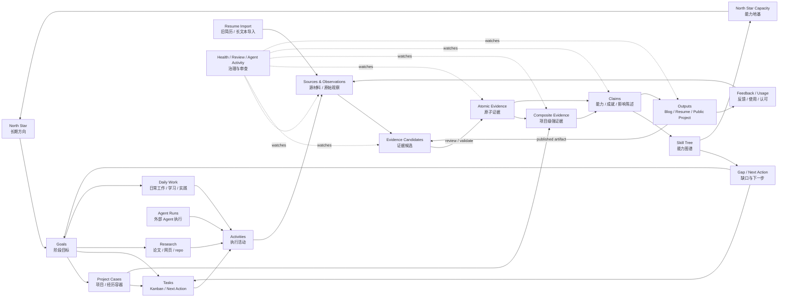

# 成长关系图谱

本文定义 nblane 中长期应遵守的成长对象模型。它不是 UI 页面列表，也不是文件说明书，而是一张可被 Web、CLI、MCP、Agent、Public Surface 共同投影的 typed graph。

核心判断：

```text
Source -> Evidence -> Claim -> Skill / Output -> Feedback -> stronger Evidence
```

更完整的成长闭环是：

```text
North Star
  -> Goals
  -> Projects / Tasks / Daily Work / Research / Agent Runs
  -> Sources and Observations
  -> Evidence Candidates
  -> Evidence Pool
  -> Claims
  -> Skill Tree / Gap / Next Action
  -> Output
  -> Feedback and Usage
  -> stronger Evidence
  -> stronger Skills
  -> North Star becomes more achievable
```

这条链路必须支持双向导航：

- 从上游看：一条简历 bullet、博客结论或 skill status 必须能追溯到哪些 evidence、source、project 和时间范围。
- 从下游看：一条 evidence 必须能知道它支撑了哪些 skill、project case、resume bullet、blog、public claim 或 next action。
- 从治理看：AI 可以生成候选、补丁和摘要，但不能静默把 source、resume import 或 output 提升成强 evidence。

## 公开架构借鉴

nblane 不需要照搬外部标准，但应吸收它们已经验证过的对象边界。

| 公开架构 | 可借鉴点 | 对 nblane 的映射 |
|----------|----------|------------------|
| [W3C PROV-O](https://www.w3.org/TR/prov-o/) | 用 Entity、Activity、Agent 表达来源、生成、派生、责任归属 | `source`、`activity`、`agent_run`、`derived_from`、`was_generated_by`、`attributed_to` |
| [W3C Verifiable Credentials Data Model](https://www.w3.org/TR/vc-data-model-2.0/) | credential 是 issuer 对 subject 的 claims；evidence 可辅助 verifier 判断可信度 | `claim` 与 `evidence` 分离；输出不是证明本身，证明要有 supporting evidence |
| [1EdTech Open Badges 3.0](https://www.imsglobal.org/spec/ob/v3p0/) | achievement / skill assertion 可以带 evidence、criteria、issuer 和 alignment | `achievement_claim`、`skill_claim`、`criteria`、`alignment`、`evidence_refs` |
| [ESCO](https://esco.ec.europa.eu/en/about-esco) | 将 occupation、skills / competences、qualifications 分成不同 pillar，并以 Linked Open Data 连接 | `role`、`skill`、`qualification` 分层，不把职位、任务和能力混成一个字段 |
| [O*NET Content Model](https://www.onetcenter.org/content.html) | 区分 worker-oriented、job-oriented、occupation-specific 信息，包含 tasks、knowledge、skills、abilities | Project / Task 是工作侧对象，Skill Tree 是能力侧对象，中间通过 evidence 和 claim 连接 |
| [Europass CV / Profile](https://europass.europa.eu/en/create-europass-cv) 与 [European Learning Model](https://europass.europa.eu/en/node/2675) | Profile 保存经历、技能和资格；CV 是选择信息后的可分享投影；ELM 用 linked data 组织学习和资格概念 | `resume-source.yaml` 是 Output Projection；Resume Import 是候选来源，不是唯一事实源 |
| [Schema.org EducationalOccupationalCredential](https://schema.org/EducationalOccupationalCredential) | 公开表达可用通用语义标记 credential、competencyRequired、recognizedBy 等 | Public Surface 可面向机器可读输出，但仍只读取确认公开的 evidence / claim |

从这些架构里抽象出 nblane 的四条基本规则：

1. **Provenance first**：任何长期 claim 都要保留来源、生成过程和派生关系。
2. **Claim is not evidence**：简历 bullet、skill status、博客结论都是 claim 或 output，不能替代 evidence。
3. **Projection is reversible only through review**：Evidence 可以生成 Resume；Resume Import 也可以反向生成 Evidence Candidate，但必须经过 review。
4. **Aggregation strengthens without erasing**：同一 Project 下多条 evidence 可以融合成 Composite Evidence，但不能覆盖或重复计算原子 evidence。

## 核心图谱



## 分层模型

nblane 的数据应被理解为一张分层图谱。文件只是 owner，不是概念边界。

| 层级 | 核心问题 | 典型对象 | 当前 / 计划事实源 |
|------|----------|----------|-------------------|
| Direction | 我长期要成为什么？ | North Star、Identity、Research Fingerprint、Thinking Style | `SKILL.md` 人写区 |
| Objective | 这个阶段我要推进什么？ | Primary Goal、Active Goals、success criteria、target skills、target outputs | `goals.yaml` |
| Work Context | 哪个工作场景承载目标和证据？ | project case、company、role、time range、milestone、scope、decision | 未来 `project-board.yaml`；公开展示用 `projects.yaml` |
| Activity | 我实际做了哪些事？ | kanban task、daily work、research activity、agent run、review、experiment | `kanban.md`、`learning-log.yaml`、`activity-log.yaml`、Agent logs |
| Source | 有哪些原始材料或观察？ | commit、PR、doc、metric、screenshot、URL、meeting note、resume import、feedback | `inbox.yaml`、repo、research source、Profile ingest |
| Evidence | 哪些事实已经可作为证明？ | atomic evidence、composite evidence、artifact ref、source refs、confidence、visibility | `evidence-pool.yaml` |
| Claim | 这些证据支撑我对外说什么？ | achievement claim、skill claim、impact claim、role claim、learning claim、project claim | `claims.yaml`；legacy `evidence-pool.yaml.claims` 仅迁移兼容 |
| Capability | 我具备哪些能力？ | skill node、status、evidence refs、claim refs、gap | `skill-tree.yaml`、`schemas/*.yaml` |
| Output | 哪些证据和 claim 可以对外表达？ | blog、resume bullet、public project、output item、media | `blog/`、`resume-source.yaml`、`projects.yaml`、`outputs.yaml` |
| Governance | 哪些内容需要审查？ | health issue、unsupported claim、privacy risk、drift、agent patch | derived / future review files |

最重要的抽象边界：

```text
Source 是材料
Evidence 是可审查事实
Claim 是解释和断言
Skill 是能力状态
Output 是表达和投影
```

如果这五层混在一起，系统会很快退化成“简历和自评的漂亮编辑器”。如果这五层清楚，nblane 才能同时支持成长、求职、公开写作和 Agent 复用。

## 机器可读元素契约

以下区块供 Dashboard、Schema、8502 Canvas 和测试读取。人类说明仍以本文正文为准；修改图谱元素时应同步更新该区块。

```yaml growth_graph_contract
schema_version: "1.1"
layers:
  - id: direction
    label: Direction
    label_zh: 方向
  - id: objective
    label: Objective
    label_zh: 目标
  - id: work_context
    label: Work Context
    label_zh: 工作语境
  - id: activity
    label: Activity
    label_zh: 活动
  - id: source
    label: Source
    label_zh: 来源
  - id: evidence
    label: Evidence
    label_zh: 证据
  - id: claim
    label: Claim
    label_zh: 断言
  - id: capability
    label: Capability
    label_zh: 能力
  - id: output
    label: Output
    label_zh: 输出
  - id: feedback
    label: Feedback
    label_zh: 反馈
  - id: governance
    label: Governance
    label_zh: 治理
roles:
  - id: trunk
    label: Trunk
    label_zh: 主干
  - id: direction
    label: Direction
    label_zh: 方向
  - id: branch
    label: Branch
    label_zh: 分支
  - id: leaf
    label: Leaf
    label_zh: 叶
  - id: fruit
    label: Fruit
    label_zh: 果
  - id: star
    label: Star
    label_zh: 星辰
  - id: constellation
    label: Constellation
    label_zh: 星座
  - id: sand
    label: Sand
    label_zh: 沙子
node_types:
  - id: north_star
    layer: direction
    role: trunk
    label: North Star
    label_zh: 长期方向
  - id: goal
    layer: objective
    role: direction
    label: Goal
    label_zh: 阶段目标
  - id: project_case
    layer: work_context
    role: branch
    label: Project Case
    label_zh: 项目案例
  - id: task
    layer: activity
    role: leaf
    label: Task
    label_zh: 任务
  - id: daily_work
    layer: activity
    role: sand
    label: Daily Work
    label_zh: 日常工作
  - id: research
    layer: activity
    role: sand
    label: Research
    label_zh: 研究
  - id: agent_run
    layer: activity
    role: ""
    label: Agent Run
    label_zh: Agent 运行
  - id: source
    layer: source
    role: sand
    label: Source
    label_zh: 来源
  - id: evidence_candidate
    layer: evidence
    role: fruit
    label: Evidence Candidate
    label_zh: 证据候选
  - id: atomic_evidence
    layer: evidence
    role: fruit
    label: Atomic Evidence
    label_zh: 原子证据
  - id: composite_evidence
    layer: evidence
    role: fruit
    label: Composite Evidence
    label_zh: 组合证据
  - id: claim
    layer: claim
    role: constellation
    label: Claim
    label_zh: 断言
  - id: skill
    layer: capability
    role: star
    label: Skill
    label_zh: 技能
  - id: gap
    layer: capability
    role: ""
    label: Gap
    label_zh: 缺口
  - id: next_action
    layer: capability
    role: ""
    label: Next Action
    label_zh: 下一步行动
  - id: output
    layer: output
    role: leaf
    label: Output
    label_zh: 输出
  - id: feedback
    layer: feedback
    role: ""
    label: Feedback
    label_zh: 反馈
  - id: capacity
    layer: governance
    role: ""
    label: North Star Capacity
    label_zh: 方向容量
  - id: health
    layer: governance
    role: ""
    label: Health
    label_zh: 健康
edge_types:
  - id: alignment
    label: Alignment
    label_zh: 对齐
  - id: contains
    label: Contains
    label_zh: 包含
  - id: generated_by
    label: Generated by
    label_zh: 生成自
  - id: source_to_candidate
    label: Source to candidate
    label_zh: 来源到候选
  - id: review
    label: Review
    label_zh: 审阅
  - id: derives
    label: Derives
    label_zh: 派生
  - id: supports
    label: Supports
    label_zh: 支撑
  - id: drives
    label: Drives
    label_zh: 驱动
  - id: produces
    label: Produces
    label_zh: 产出
  - id: feedback
    label: Feedback
    label_zh: 反馈
  - id: watches
    label: Watches
    label_zh: 监控
```

## 对象关系

### North Star

North Star 是长期方向，不是事实源聚合器。它不直接证明能力，也不直接挂所有任务。

它应该连接：

```text
North Star -> Goal
North Star -> skill priority
North Star -> project theme
```

它不应该直接连接：

```text
North Star -x-> raw daily log entry
North Star -x-> unreviewed source
North Star -x-> unsupported public claim
```

解释：North Star 是方向选择；真正让它可实现的是被 evidence 和 claim 支撑的 skill。

### Goals

Goal 是阶段目标，通常覆盖 4-8 周。一个阶段可以有一个 primary goal 和多个 active goals。

Goal 负责连接方向与执行：

```text
North Star -> Goal -> Project Case
North Star -> Goal -> Kanban Task
Goal -> target skills
Goal -> expected evidence
Goal -> expected output
```

Goal 不拥有 skill status，也不拥有 evidence 本体。

不变量：

- `goals.yaml` 可以存 `skill_links`，表示“这个目标需要哪些技能”。
- `skill-tree.yaml` 继续拥有 skill status。
- `evidence-pool.yaml` 继续拥有 evidence 本体。
- Goal 的完成度最终应由 evidence、claim 和 output 反向证明。

### Project Case

Project Case 是比 kanban task 更稳定的工作/经历容器。它可以承载多个任务、活动、决策、source、evidence、claim 和 output。

Project Case 不一定等于公开项目。它也可以是：

- 一段公司经历中的核心项目。
- 一个开源项目或 side project。
- 一个研究复现或实验系列。
- 一个跨数周的学习/写作/产品化主线。
- 一个从旧简历中拆出来的工作片段，等待证据补全。

关系：

```text
Goal -> Project Case -> Task / Activity
Project Case -> Source
Project Case -> Atomic Evidence
Project Case -> Composite Evidence
Project Case -> Claim
Project Case -> Output
```

需要区分三类 project：

| 类型 | 作用 | 典型 owner |
|------|------|------------|
| Internal Project Case | 私有执行、实验、决策、失败、阻塞和 source 的容器 | 未来 `project-board.yaml` |
| Experience Project Case | 求职视角下的公司 / 角色 / 时间段 / 项目成果容器 | `resume-source.yaml` 的生成来源；未来可有 `experience.yaml` |
| Public Project | 对外展示的项目聚合视图 | `projects.yaml` |

不变量：

- Project Case 可以生成 Composite Evidence，但 Project Case 本身不是强 evidence。
- 公开项目只读取人工确认可公开的 evidence、claim 和文案。
- 同一 Project Case 下的 resume import、daily work、artifact 和 feedback 可以互相 corroborate，但不能互相覆盖。

### Kanban Tasks

Kanban 是执行面，不是长期知识库。

关系：

```text
Goal / Project Case -> Kanban Task
Kanban Task -> Done
Done -> Evidence Candidate
Evidence Candidate -> Evidence
```

看板状态建议统一理解为：

| 状态 | 含义 | 与 evidence 的关系 |
|------|------|--------------------|
| Queue | 准备做 | 不产生 evidence |
| Doing | 正在做 | 可产生过程记录 |
| Done | 已完成 | 可生成 evidence candidate |
| Someday / Maybe | 低承诺想法 | 可回到 Queue 或 Inbox |
| Archive | 冷历史 | 默认不进首屏，但可用于 review / search |

不变量：

- Done task 本身不是 evidence。
- Done task 经过 review / crystallize 后，才能成为 evidence。
- 看板可以发起 evidence 候选，但不能静默升级 skill status。

### Daily Work / Daily Log

Daily Work 是日常工作和生活节奏的事实源，包括项目进展、学习记录、论文阅读、锻炼、练习和 routine check-in。

Check-in 不是一个独立层级，而是写入 Daily Work / Daily Log 的交互动作：

```text
check in learning / exercise / practice / work progress
  -> Daily Work entry
```

关系：

```text
Daily Work -> Source / Observation
Daily Work -> Evidence Candidate
Daily Work -> Goal progress signal
Daily Work -> Project Case
Daily Work -> Learning / Research Source
```

不变量：

- 学习 40 分钟不是强 evidence。
- 完成复现、写出实验记录、形成公开复盘、交付可验证 artifact，才更接近强 evidence。
- 锻炼打卡主要服务长期节奏和 health，不应污染 skill status。
- 日常记录可以提供 chronology、effort 和 continuity，但要成为强 evidence 还需要 artifact、metric、decision、feedback 或 project outcome。

### Research

Research 存外部来源，不等于 evidence。

对象包括：

- paper
- web page
- PDF
- GitHub repo
- dataset
- source chunk
- highlight
- claim
- citation
- synthesis draft
- reproduction / experiment result

关系：

```text
Research Source -> Claim
Research Source -> Citation
Research Source -> Evidence Candidate
Research Source -> Blog / Synthesis Draft
Research Source -> Skill Gap
```

不变量：

- source 不是 evidence。
- 阅读不是 mastery。
- 摘要不是 proof。
- 复现、实现、实验、项目使用、公开复盘等经过确认后，才可升格为 evidence。

### Resume / Long Text Import

Resume import 和 long text ingest 是批量导入入口，不是最终事实源。

旧简历有特殊价值：它通常是用户为了求职已经提炼过的强相关经历，包含时间、公司、角色、项目、动作和量化结果。因此它应该被视为高价值 source，而不是普通 note。

但旧简历仍然不是自动可信的强 evidence：

```text
Resume Import
  -> Source
  -> Evidence Candidates
  -> Project Case / Experience Case
  -> Atomic Evidence or Composite Evidence after review
  -> Skill Claims
  -> Resume Source regenerated from evidence
```

对 Resume Import 的判断：

| 维度 | 结论 |
|------|------|
| Career relevance | 通常较强，因为用户已经为招聘场景筛选过 |
| Specificity | 如果包含时间、公司、角色、指标、项目名，则较强 |
| Verification | 默认中等或未知，需要 artifact、metrics、feedback、reference 补强 |
| Output readiness | 较强，可以快速生成 resume candidate |
| Evidence status | 默认只是 candidate，不能直接升级 skill |

不变量：

- 导入内容默认只是候选。
- 需要人工审阅后才写入 `evidence-pool.yaml` 和 `skill-tree.yaml`。
- 简历输出应从 evidence / claim 重新组织，而不是把 raw resume 当成唯一事实源。
- 如果旧简历 bullet 与某个 Project Case 下的 daily work、artifact、PR、指标或反馈一致，它可以提升该 Project Case 的可信度。
- 如果旧简历 bullet 只是重复已有事实，不能因为“resume 也说了一遍”而重复计分。

### Evidence

Evidence 是 nblane 的核心沉淀层。它不是所有材料的集合，而是经过 review 后可以被反复引用的证明对象。

Evidence 应回答：

- 发生了什么？
- 何时发生？
- 在哪个 project / company / role / context 下发生？
- 来源是什么？
- 为什么可信？
- 证明了什么 claim？
- 关联哪些 skill / goal / output？
- 是否可以公开？
- 强度和置信度如何？

关系：

```text
Source -> Evidence Candidate -> Evidence
Evidence -> Claim
Evidence -> Skill
Evidence -> Goal
Evidence -> Project Case
Evidence -> Blog
Evidence -> Resume
Evidence -> Public Project
```

不变量：

- 所有长期可复用事实最终应尽量沉淀为 evidence。
- Evidence 可以来自 task、project、research、daily work、resume import、output artifact、public feedback 和 agent run。
- Evidence 不直接等于 skill；它需要被 claim / skill tree 引用，才支撑能力状态。
- Evidence 的强度来自 provenance、specificity、artifact、metric、role clarity、triangulation 和 external feedback。

### Atomic Evidence

Atomic Evidence 是最小可审查事实。它只证明一个相对清晰的事情，避免一条 evidence 同时塞入太多 claim。

示例：

```yaml
id: evidence:nblane-dashboard-payload-2026-05
kind: atomic
summary: Implemented dashboard payload normalization and tests.
time_range: 2026-05-10/2026-05-12
project_refs:
  - project:nblane-web-workbench
source_refs:
  - commit:abc123
  - test:tests/test_home_dashboard.py
claim_refs:
  - claim:frontend-data-contract
skill_refs:
  - skill:frontend_state_modeling
  - skill:product_system_design
strength: medium
visibility: private
```

Atomic Evidence 的好处：

- 可追溯。
- 可复用到多个 claim。
- 可被 Project Case 聚合。
- 可被 Resume / Blog / Public Project 选择性投影。

### Composite Evidence / Evidence Bundle

Composite Evidence 是从多条 Atomic Evidence、source 和 feedback 中派生出的项目级强证据。它通常对应一个 Project Case 或 Experience Case。

回答用户的问题：**如果日常工作记录和旧简历分解出来的 evidence 属于同一个 project，它们可以融合为一个更强 evidence 吗？**

可以，但应该融合成一个派生对象，而不是把原始证据合并丢失：

```text
Daily Work Evidence
Resume-imported Candidate
Project Artifact
Metric / Feedback
  -> Project Case
  -> Composite Evidence
  -> Achievement Claim / Skill Claim / Resume Bullet
```

Composite Evidence 的成立条件：

| 条件 | 说明 |
|------|------|
| 同一 scope | 指向同一个 project / company / role / time range |
| 事实一致 | 时间、角色、指标、项目名、动作没有明显冲突 |
| 来源多样 | 至少有两类来源，例如 daily work + artifact，resume + metric，PR + feedback |
| 有可验证产物 | 代码、文档、demo、实验、发布、截图、公开链接、指标记录等 |
| 有明确贡献 | 能说明用户的角色、动作、决策或 ownership |
| 有 outcome | 最好有量化结果、用户影响、效率提升、招聘认可、引用、使用或复盘 |

Composite Evidence 的典型字段：

```yaml
id: evidence:project:nblane-web-experience-2026
kind: composite
scope: project
project_ref: project:nblane-web-workbench
derived_from:
  - evidence:nblane-dashboard-payload-2026-05
  - evidence:nblane-goal-privacy-2026-05
  - source:resume-import:2026-05:bullet-03
  - source:feedback:demo-review-2026-05
aggregation_policy: corroborates
claim_refs:
  - claim:designed-local-first-growth-workbench
skill_refs:
  - skill:ai_product_architecture
  - skill:frontend_system_design
strength: strong
confidence: high
visibility: private
```

关键不变量：

- Composite Evidence 必须保留 `derived_from`，不能替代 child evidence。
- 子 evidence 可以被多个 Composite Evidence 引用，但 scoring 需要避免重复计数。
- Resume import 可以参与 corroboration，但如果它只是复述同一事实，不应独立增加强度。
- Output 不能给自己的来源“自我背书”。例如由 evidence 生成的 resume bullet，不能再被导入后反向提升原 evidence；除非出现外部反馈、招聘认可或面试使用记录等新 source。

### Claims

Claim 是对 evidence 的解释，也是面向外部表达前的 reusable public assertion。它介于 evidence 和 skill/output 之间，不是 Done task 的包装句，也不是最终博客/简历文案。

为什么需要 Claim 层：

- Evidence 说“发生了什么”。
- Claim 说“这些 evidence 支撑我对外主张什么”。
- Skill status 说“这个能力状态如何”。
- Resume bullet 说“如何面向某个招聘场景表达”。

Claim 类型：

| 类型 | 例子 | 下游 |
|------|------|------|
| Achievement Claim | 完成了某个项目、交付、实验或发布 | Resume、Public Project、Blog |
| Skill Claim | 能稳定完成某类任务或使用某项技术 | Skill Tree、Gap Analysis |
| Impact Claim | 产生了量化影响、质量改进、效率提升 | Resume、Public Profile |
| Role Claim | 在项目中承担 owner / lead / contributor / reviewer | Resume、Project Page |
| Learning Claim | 完成某方向学习并能复现或应用 | Skill Tree、Research View |

关系：

```text
Evidence -> Claim
Claim -> Skill status review
Claim -> Resume Bullet
Claim -> Blog section
Claim -> Public Project
Claim -> Goal progress
```

不变量：

- Unsupported claim 必须被 Health / Review 标出。
- 一个 claim 可以有多个 evidence refs。
- 一个 evidence 可以支撑多个 claim，但 claim 的语义要具体，避免“万能证据”。
- Public claim 只能引用 visibility 允许公开的 evidence 或经过脱敏的 claim。
- Claim 应关联 `project_refs` 和 `goal_refs`：`project_refs` 可由 evidence row、Project Case、milestone 聚合而来；`goal_refs` 可由 Project Case、Goal evidence refs、Research Source 派生，并可人工修正。
- Accepted claim 不应因新 evidence 静默改写；新 evidence 只能触发 `needs_refresh` 或生成 refresh proposal，由用户确认后更新，同步保留 history。
- `claims.yaml` 是通用 Evidence Claim 的事实源；`research/claims.yaml` 是 source-aware research claim store，两者不合并。

### Skill

Skill 是由 evidence 和 claim 支撑的能力图谱，是 North Star 的能力地基。

关系：

```text
Evidence -> Claim -> Skill
Skill -> Gap
Skill -> Next Action
Skill -> North Star Capacity
```

Skill status 的含义：

| 状态 | 含义 | Evidence / Claim 要求 |
|------|------|-----------------------|
| locked | 尚未进入 | 可以没有 evidence |
| learning | 正在学习 / 有初步实践 | 弱 evidence、学习记录或初步 claim |
| solid | 能稳定使用 | 中强 evidence，最好有项目、artifact 或复盘 |
| expert | 高可信、可迁移、可指导他人 | 强 evidence、复杂项目、公开输出、外部反馈或可重复成果 |

不变量：

- `skill-tree.yaml` 拥有 skill status。
- Goal 只能声明需要哪些 skills，不能声明 skill 已掌握。
- North Star 的实现能力来自 skill tree 的长期加固。
- `solid` 和 `expert` 层级应优先引用 Composite Evidence 或多条相互印证的 Atomic Evidence。

### Blog / Public Output

Output 是 evidence 和 claim 的表达层；在发布、被使用、被引用、收到反馈或形成可验证 artifact 后，它也可以反向成为新的 evidence source。

因此 Blog 有双重身份：

- 写作过程中，它是 output draft。
- 发布后，如果能证明某项能力、项目成果或外部影响，它可以成为 evidence candidate。

关系：

```text
Evidence / Claim -> Blog
Evidence / Claim -> Resume Bullet
Evidence / Claim -> Public Project
Evidence / Claim -> Output Item
Blog / Output Artifact -> Source / Evidence Candidate
Public Feedback / Usage / Citation -> Evidence Candidate
```

不变量：

- 公开输出应追溯到 evidence、claim 或 source。
- Blog 不能因为“写了”就自动成为强 evidence；需要发布、质量、引用、反馈、项目关联或可验证 artifact 来支撑强度。
- unsupported claim 需要 review。
- Public Surface 不直接发布私有 kanban、完整 skill tree、research raw source 或 agent profile。

### Resume 双向投影

Resume 是 Output Projection，也是可能的 Source。

正向链路：

```text
Evidence
  -> Claim
  -> Experience / Project Case
  -> Resume Bullet
  -> Tailored Resume
```

反向链路：

```text
Imported Resume
  -> Source
  -> parsed Experience / Project / Bullet / Metric
  -> Evidence Candidate
  -> Project Case
  -> Evidence / Claim after review
```

Resume 的生成应按招聘心智组织，而不是按内部文件组织：

| Resume 视角 | nblane 来源 |
|-------------|-------------|
| 时间 | evidence / project case 的 `time_range` |
| 公司 | experience case 的 organization |
| 角色 | role claim / project contribution |
| 项目 | project case / public project |
| 动作 | achievement claim |
| 技术 | skill refs / tool refs |
| 量化产出 | impact claim / metric source |
| 可信来源 | evidence refs / artifact refs |

Resume 生成不应直接读取 raw daily log，而应读取经过确认的 evidence / claim：

```text
Daily Work -> Evidence -> Claim -> Resume Bullet
```

Resume 导入也不应直接写入 resume-source 的最终层，而应先拆成候选：

```text
Resume Import -> Evidence Candidate -> Review -> Evidence / Claim -> Resume Source
```

循环防护：

- 如果 resume bullet 是由 nblane evidence 生成的，再导入时应识别 `derived_from`，避免自我增强。
- 如果旧简历来自外部历史文件，且没有 lineage，可以作为 source，但必须标记 `origin: resume_import`。
- 只有新出现的外部反馈，例如面试通过、招聘方认可、公开引用、真实使用，才能作为新的 evidence source 反哺原项目。

### Health / Review / Agent Activity

Health、Review 和 Agent Activity 是治理层，负责发现风险和生成候选。

关系：

```text
Health -> drift / missing evidence / unsupported claim / privacy risk
Review -> Evidence Candidate / Claim Candidate / Next Action Candidate / Public Candidate
Agent Activity -> Patch Candidate / Source / Evidence Candidate
```

不变量：

- Governance 层不直接替代 owner 文件。
- AI / Agent 产物默认 draft-first。
- 写入 evidence、claim、skill、goal、public output 必须经过预览、校验或人工确认。

## 事实沉淀规则

所有元素最终应遵守以下路径。

### 原始材料进入 Evidence

```text
Kanban Done
Daily Work Entry
Project Artifact
Research Reproduction
Blog / Output Artifact
Public Feedback
Resume Import
Agent Run Result
  -> Source / Observation
  -> Evidence Candidate
  -> Evidence Pool
```

不要求所有原始事实立刻变成 evidence，但长期有价值的事实应该有机会被 review。

### Evidence 支撑 Claim

```text
Evidence Pool
  -> Claim Studio
  -> claims.yaml
  -> achievement / skill / impact / role / learning / project claim
  -> unsupported claim check
```

Evidence 不应该直接变成面向外部的表达。中间需要 Claim 层把“发生了什么”翻译成“这些事实支撑我对外说什么”。Claim Studio 应从全部 reviewed evidence graph 按 project / goal / skill / all evidence / manual 范围生成和滚动刷新 claim，而不是只把某个 Done 或某条 evidence 改写成一句话。

### Claim 支撑 Skill

```text
Claim
  -> skill-tree.yaml:evidence_refs / claim_refs
  -> skill status review
  -> Gap Analysis
```

能力状态不应只来自自我感觉。至少在 `solid` 和 `expert` 层级，缺 evidence 或缺 claim 应被 Profile Health / Dashboard 标出。

### Project 聚合强证据

```text
Atomic Evidence
  -> Project Case
  -> Composite Evidence
  -> stronger Achievement Claim
  -> stronger Skill Claim
  -> Resume / Blog / Public Project
```

Project 不是证据本体，但它是 evidence 的重要上下文。强 evidence 往往不是单条 daily log，而是一个 Project Case 下多条 source 和 evidence 的一致性。

### Skill 支撑 North Star

```text
Skill Tree
  -> capability map
  -> gap / next action
  -> project selection
  -> North Star capacity
```

North Star 不应只是口号；它应该能被拆解成长期技能组合、项目路线和 evidence 积累。

### Output 反哺 Evidence

```text
Blog / Resume / Public Project
  -> published artifact / feedback / usage / recognition
  -> Evidence Candidate
  -> Evidence
  -> stronger Claim
  -> stronger Skill
```

公开输出不是闭环终点。真实反馈、被引用、被使用、被复现、被招聘方认可等，都可以成为新的 evidence。

## 双向链路设计

双向链路不是每个文件手写两份引用，而是 owner 文件 + 派生索引共同完成。

### 上游追溯

任何下游对象都应能回答“你从哪里来”：

```text
Resume Bullet
  -> claim_refs
  -> evidence_refs
  -> source_refs
  -> project_ref
  -> time_range
```

适用对象：

- skill status
- resume bullet
- blog claim
- public project claim
- gap explanation
- agent context summary

### 下游使用

任何 evidence 都应能回答“你被用在了哪里”：

```text
Evidence
  -> used_by_claims
  -> used_by_skills
  -> used_by_outputs
  -> used_by_goals
  -> used_by_project_cases
```

下游使用关系可以由索引计算，不一定写回 evidence owner 文件。

### 关系类型

建议固定 relation vocabulary：

| relation | 含义 |
|----------|------|
| `aligns_to` | 方向或目标对齐 |
| `drives` | 推动下游行动 |
| `contains` | 容器包含子对象 |
| `part_of` | 子对象属于上游容器 |
| `produces` | 活动产生 source / artifact |
| `derived_from` | 下游对象由上游派生 |
| `was_generated_by` | source / evidence 由某 activity 生成 |
| `attributed_to` | 责任归属到人、角色或 agent |
| `supports` | evidence 支撑 claim / skill / output |
| `corroborates` | 多条来源相互印证 |
| `contradicts` | 来源之间冲突，需要 review |
| `summarizes` | output / claim 总结多个证据 |
| `publishes_as` | 私有对象投影为公开输出 |
| `cites` | 引用外部 source |
| `needs_review` | 需要人工审查 |

### Owner 与派生索引

建议原则：

| 数据 | 写入 owner | 下游索引 |
|------|------------|----------|
| Evidence 本体 | `evidence-pool.yaml` | used_by、claim_refs、project graph |
| Skill status | `skill-tree.yaml` | supported_by evidence / claim |
| Resume bullet | `resume-source.yaml` | derived_from evidence / claim |
| Public project | `projects.yaml` | derived_from private project case |
| Blog | `blog/*.md` | claim / citation / evidence graph |
| Project case | 未来 `project-board.yaml` | contains task / source / evidence |

不变量：

- owner 文件负责权威字段。
- graph payload 可以计算反向边。
- AI 写回应展示将影响哪些 owner 和 derived index。

## Evidence 强度模型

Evidence strength 不应只看文案好不好，而应看可验证性。

建议维度：

| 维度 | 问题 |
|------|------|
| Provenance | 来源是否清楚？是否知道谁在何时生成？ |
| Specificity | 是否有时间、角色、动作、对象、上下文？ |
| Artifact | 是否有代码、文档、demo、截图、发布物、实验记录？ |
| Metric | 是否有量化结果、对比基线、用户影响？ |
| Role clarity | 用户在其中的贡献是否清楚？ |
| Triangulation | 是否被多种来源相互印证？ |
| External validation | 是否有使用、引用、反馈、面试、认可或第三方证据？ |
| Recency / duration | 是一次性尝试，还是持续稳定能力？ |
| Privacy / publishability | 是否可公开或可脱敏？ |

强度建议：

| 等级 | 定义 | 例子 |
|------|------|------|
| weak | 有记录，但主要证明投入或兴趣 | 阅读打卡、学习 40 分钟、收藏链接 |
| medium | 有具体交付或初步 artifact | 完成 demo、写出实验记录、合并 PR |
| strong | 有 project context、明确贡献、artifact 和 outcome | 交付项目模块、指标改善、公开复盘 |
| high_trust | 有多源印证、外部反馈、复杂度或可迁移性 | 被使用/引用、复杂项目 owner、招聘或客户认可 |

Resume Import 的默认强度不应直接设为 strong。更合理的默认是：

```text
resume import = high relevance + medium confidence + needs review
```

当它与项目 artifact、daily work、metric、feedback 一致时，可以参与生成 strong / high_trust Composite Evidence。

## View 投影

同一张关系图谱可以投影成不同 UI，而不是把所有节点一次性塞进 Dashboard。

### Context View

用于 Home Dashboard 首屏。

```text
North Star -> Goals -> Project Cases -> Claims / Skills / Evidence / Output / Health
```

目标：60 秒内知道方向、阶段目标、能力进度、风险和下一步。

### Execution View

用于 Kanban / Project Board。

```text
Goal -> Project Case -> Queue / Doing / Done / Archive -> Evidence Candidate
```

目标：推进当前工作，并把 Done 任务整理成 evidence candidate。

### Evidence View

用于 Evidence / Skill Tree / Review。

```text
Source -> Evidence Candidate -> Atomic Evidence -> Composite Evidence -> Claim -> Skill / Output
```

目标：审查证据、关联技能、标记强度，并在 Claim Studio 中生成或刷新可复用的对外主张，再准备公开输出。

### Project Case View

用于未来 Project Board / Experience Review。

```text
Company / Role / Time Range
  -> Project Case
  -> Tasks / Sources / Atomic Evidence
  -> Composite Evidence
  -> Claims
  -> Resume / Public Project / Blog
```

目标：把散落日常工作、旧简历 bullet、项目产物和反馈汇总成可审查项目经历。

### Research View

用于未来 Research Workspace。

```text
Source -> Chunk -> Claim -> Citation -> Evidence Candidate / Blog Draft
```

目标：让网页、论文和 repo 先保持 source-aware，不提前污染 skill status。

### Resume View

用于 Output Studio / Resume。

```text
Evidence / Claim
  -> Experience Case
  -> chronological company / role / project / impact
  -> tailored resume
```

目标：按时间、公司、角色和量化产出汇总，但每条 bullet 都能追溯 evidence。

### Public View

用于 Public Site。

```text
Evidence / Claim -> Blog / Resume / Public Project / Output
```

目标：把可信证据转成公开表达，并检查隐私和 unsupported claim。

### Health View

用于 Profile Health / Review。

```text
Files / Generated Blocks / Evidence Risk / Unsupported Claims / Resume Loops -> Review Candidates
```

目标：发现 drift、缺 evidence、未结晶 Done、公开风险和循环背书。

## Workspace Graph 契约建议

后续 Dashboard、2D Canvas、3D Graph、Review 和 MCP 可以共享一个 read model：

```python
workspace_graph_payload(profile, view="context")
```

Web 侧栏导航只是这张图谱的任务投影：用户按 Home / Work / Growth / Output / Team
进入工作流，不等于图谱层级本身被拆成页面层级。页面应帮助用户沿着
`Source -> Evidence -> Claim -> Skill / Output` 前进，而不是要求用户理解所有底层 owner 文件。

建议节点字段：

```yaml
nodes:
  - id: evidence:project:nblane-web-experience-2026
    type: evidence
    kind: composite
    layer: evidence
    label: nblane Web workbench project evidence
    owner: evidence-pool.yaml
    status: reviewed
    visibility: private
    strength: strong
    confidence: high
    project_refs:
      - project:nblane-web-workbench
    source_refs:
      - evidence:nblane-dashboard-payload-2026-05
      - source:resume-import:2026-05:bullet-03
    refs: []
```

建议边字段：

```yaml
edges:
  - from: source:resume-import:2026-05:bullet-03
    to: evidence:project:nblane-web-experience-2026
    relation: corroborates
    suggested: false
    strength: 0.7
```

建议固定 layer：

```text
direction
objective
work_context
activity
source
evidence
claim
capability
output
governance
```

建议固定 node type：

```text
north_star
goal
project_case
task
activity
source
evidence_candidate
evidence
claim
skill
gap
output
review_issue
agent_run
```

建议固定 relation：

```text
aligns_to
drives
contains
part_of
depends_on
produces
derived_from
was_generated_by
attributed_to
supports
corroborates
contradicts
summarizes
publishes_as
cites
needs_review
```

关键要求：

- 隐私脱敏在 read model 阶段完成。
- Dashboard 只读聚合，不成为事实源。
- AI 只能生成 candidate，不能静默改 owner 文件。
- Graph 展示的是事实源的投影，不是新的事实源。
- 反向边可以由 index 生成，避免在多个 owner 文件中手写重复关系。

## 最小不变量

1. North Star 是方向，Skill 是能力地基，Evidence 是能力地基的证明。
2. Source、Evidence、Claim、Skill、Output 必须分层，不能互相替代。
3. 所有长期有价值事实最终应尽量沉淀为 evidence。
4. Evidence 先于 skill status、public claim 和 resume bullet。
5. Research source、Daily Work、Done task、resume import 都只是 evidence 的来源，不自动等于 evidence。
6. 旧简历是高价值 source 和 career-relevant candidate，但不是自动强 evidence。
7. 同一 Project Case 下多条 evidence 可以派生 Composite Evidence，但必须保留 child evidence 和 `derived_from`。
8. Resume 是 evidence / claim 的输出投影；Resume Import 是 source / candidate 的反向入口。
9. Output 是 evidence 的表达；发布后的 blog、公开 artifact 和真实反馈也可以反哺为新的 evidence。
10. Goal 组织阶段行动，但不拥有 skill status 和 evidence 本体。
11. Public Surface 只读取人工确认可公开的对象。
12. Health / Review / Agent Activity 只生成风险、候选和补丁，不绕过人工确认。
