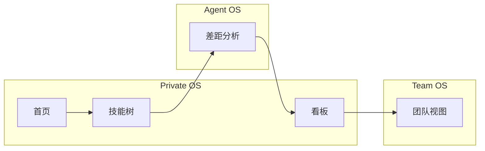

# Web 体验设计（Streamlit）

本章说明与 [product.md](product.md) 中产品分层对齐的 **信息架构、首屏叙事、标题与品牌一致性、版式节奏**。不是完整视觉规范；可选实现项以 **backlog** 列出供后续迭代。

| 项目 | 说明 |
|------|------|
| 范围 | 本地 Streamlit（`app.py`、`pages/`） |
| 对照 | [design.md](design.md) §3.4（已交付页面清单） |
| 非目标 | 自定义 CSS / 组件库、MCP 界面、替换 Streamlit 框架 |

**英文版：** [web-ui-product.md](../web-ui-product.md)

---

## 1. 角色与范围

Web 是与 CLI、仓库目录（`profiles/`、`teams/`）一致的 **本地、文件驱动工具**。它 **不是** [product.md](product.md) 路线图中的 **Public Surface**：无托管页面、无对外分享 URL。

**边界：** 所有变更落盘为 Markdown / YAML；行为应能与 [design.md](design.md) 中的 `nblane` 命令对照解释。

---

## 2. 现状诊断（产品视角）

### 2.1 功能覆盖与叙事

| 产品层（[product.md](product.md)） | 当前 Web 映射 | 缺口 |
|-----------------------------------|---------------|------|
| **Private OS**（技能、目标、项目、证据） | 技能树、看板、首页概览、证据池 | 无独立 **目标** 入口；首页偏重 SKILL.md 与摘要，与新用户理解「技能树主阵地」的关系不够直观 |
| **Agent OS** | 差距分析（规则 + 可选 LLM）、与 context 相关的文案 | 缺少显式说明：本页是 **与 Agent 协作** 的界面 |
| **Team OS** | 团队视图 | 与侧栏 **Profile** 的关系未说明；团队页调用 `select_profile()` 但 **未使用返回值**，易产生「选档案会不会影响团队数据？」的困惑 |

**小结：** 功能密度与文件模型一致，但 **用户任务 → 页面** 的导览偏弱；产品语言（共进化、证据溯源）在界面里多为隐式。

### 2.2 排版与信息节奏

- **首页**（`app.py`）：概览指标、分类进度、可折叠分类、简历摄入、长篇 `home_nav` Markdown。**纵向过长**，首屏难以回答「我现在该点哪里」。
- **技能树**（`pages/1_Skill_Tree.py`）：主 **保存** 在标题行——四个子页中 **唯一**；看板采用不同工具栏模式（如 Reload / Save）。
- **差距分析 / 看板：** 宽表 + 多 expander，符合工具型产品；**未配置 LLM** 时依赖公共组件与各页 `ai_not_configured` 文案——**统一空状态表述**（小组件式复用）可降低不一致感。

### 2.3 标题与品牌

| 位置 | 现状 | 问题 |
|------|------|------|
| 浏览器标签（首页） | `web_i18n` 的 `_HOME` 中 `app_page_title` 为 **NBL** | **品牌分裂：** README 为「nblane · 大佬之路」，子页为「· nblane」 |
| 侧栏 | `### Profile`（中英相同） | 层级偏弱；中文界面下 **Profile** 在大量文案中仍为英文 |
| 中文界面 | `UI_LANG=zh` 驱动整站文案，但 `home_nav` 等仍出现 **Skill Tree / Gap Analysis** 等英文页名 | 导航说明 **中英混杂** |
| 页面内顺序 | 看板 / 差距 / 团队：**先 `st.title` 再 `select_profile()`**；首页 / 技能树：**先 `select_profile()` 再标题** | 「当前是谁的上下文」的 **第一印象顺序** 不统一 |

**文档建议：** 全站统一 **标题公式**（如 `"{功能名} · nblane"`）；首页标签与之一致；侧栏与页名在 zh 下完整本地化（需改 `web_i18n`，非仅文档）。

### 2.4 可访问性与信息密度

指标、看板列、团队池等处大量使用 **emoji**，情绪友好但对读屏与部分严肃场景不友好。可逐步改为 **文字标签** 或单一语义强调（差距页已有色带；**设计 token** 可作为后续文档化方向）。

**侧栏页面顺序** 由 Streamlit 对 `pages/1_…`–`4_…` 的文件名决定，与 **推荐动线** 未必一致；见 §4。

---

## 3. 设计原则（少而硬）

1. **一条主路径：** 新用户约 **60 秒内**完成「选档案 → 看到技能状态 → 知道下一步」（补证据 / 跑差距 / 打开看板）。
2. **产品语言外露：** 每页首屏 **一行非技术说明**（可与 caption 同级），对应 Private / Agent / Team OS 之一。
3. **用户向命名：** 动词或结果优先于文件向表述（如将「Raw」明确为 SKILL.md 源码类说法）；翻译时 **中英同步**。
4. **版式：** 首页把导航长文 **缩短** 为一条 `st.info` 或短链 + 指向 `docs/`；重型流程（简历摄入、Done→证据）放在 expander，避免与首屏概览争抢。
5. **一致性：** 全站统一 **先 Profile 再标题** 或相反；团队页要么 **使用** 所选档案（如未来按人过滤），要么 **隐藏侧栏档案** 并写明团队数据在 `teams/`。

---

## 4. 页面地图与用户动线

### 4.1 与产品层的对应

意图简述：**首页** 定调与长文摄入；**技能树** 是结构化技能面；**差距分析** 用任务对照技能树；**看板** 承载执行与 **Done→证据**；**团队** 编辑 `teams/` 下共享池。

### 4.2 建议动线

**首次使用：** 初始化 / 侧栏选档案 → **技能树**（状态与证据）→ 大任务前 **差距分析** → **看板** 推进进行中的事 → 协作时 **团队视图**。

**日常使用：** 看板 + 技能树微调；在配置 LLM 时周期性做差距分析与简历 / 看板摄入。

**页面与文件、功能对照** 以 [design.md](design.md) §3.4 为准。

---

## 5. 版式说明（非强制）

- **首页首屏顺序：** 指标 / 摘要优先；导航提示紧凑；长 Markdown 导航后置或改为外链。
- **主操作位置：** 要么把 **技能树** 标题行保存推广到其他页，要么把技能树操作收拢到 **统一工具栏**——二选一，并在代码注释 / i18n 中保持一致约定。

---

## 6. 文案与品牌检查清单

- **浏览器 `page_title`：** 首页与子页、README 用语对齐。
- **侧栏：** 「档案 / Profile」等清晰标签与层级（不宜仅有 `### Profile`）。
- **中文完整性：** `home_nav` 与常用 UI 在 `UI_LANG=zh` 时应为中文页名与说明。
- **H1 与侧栏：** 明确主标题展示什么、与 Streamlit 根据 `pages/` 文件名生成的侧栏标签如何分工。

---

## 7. 已知摩擦与 backlog

每条标注 **仅文档**（靠本文或流程解决）或 **需改代码**。

| 项 | 说明 | 标签 |
|----|------|------|
| 团队视图 + Profile | `select_profile()` 未使用；需说明或接通行为 | **需改代码** |
| `st.title` / `select_profile` 顺序 | 各页不一致 | **需改代码** |
| 首页标签 **NBL** vs **nblane** | 在 `_HOME` 统一品牌串 | **需改代码** |
| 首页过长 `home_nav` | 按 §3 缩短或挪位 | **需改代码** |
| 中文导航纯净度 | 导航文案中的页名本地化 | **需改代码** |
| 未配置 AI 的提示 | 共享空状态组件或统一文案键 | **需改代码** |
| Emoji 密度 | 可选「减弱动效 / 无 emoji」模式 | **需改代码**（可选） |
| 推荐动线 vs `1_`–`4_` 顺序 | §4 已文档化；是否改文件名由产品决定 | **仅文档** / **需改代码** |

---

## 8. 相关文档

- [product.md](product.md) — Private / Agent / Team OS 定义
- [design.md](design.md) — §3.4 Web UI 表、里程碑
- [web-ui.md](web-ui.md) — 使用手册（运行方式、侧栏、分页面、与 CLI 对照）
- [README.md](../../README.md) — 快速开始与文档索引
